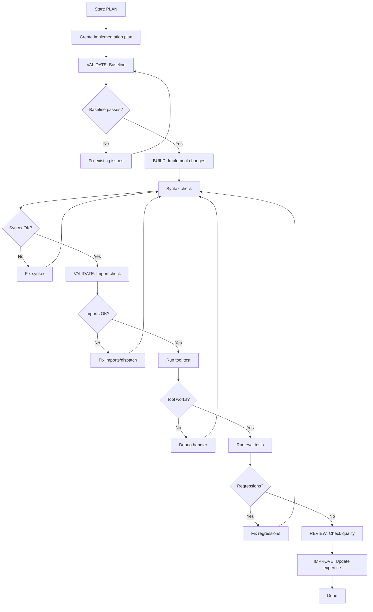

# Backend Expert - Plan Build Improve Workflow

> Full ACT-LEARN-REUSE workflow for backend development.

## Purpose

Execute the complete backend development workflow:
1. **PLAN** - Design changes using expertise
2. **VALIDATE (baseline)** - Run syntax check and current tests
3. **BUILD** - Implement the changes
4. **VALIDATE (post)** - Verify no regressions
5. **REVIEW** - Check code quality and patterns
6. **IMPROVE** - Update expertise with learnings

## Usage

```
/experts:backend:plan_build_improve [feature description or change]
```

## Variables

- `TASK`: $ARGUMENTS

## Allowed Tools

`Read`, `Write`, `Edit`, `Bash`, `Grep`, `Glob`

---

## Workflow

### Step 1: PLAN (Context Loading)

1. Read `.claude/commands/experts/backend/expertise.md` for:
   - Tool dispatch architecture
   - Handler patterns and signatures
   - Tenant scoping rules
   - Known issues

2. Analyze the TASK:
   - Search codebase for relevant implementations
   - Identify which sections of `app/agentic_service.py` are affected
   - Determine dependencies

3. Create implementation plan:
   - Write to `.claude/specs/backend-{feature}.md`
   - Include registration checklist
   - Include validation strategy

---

### Step 2: VALIDATE (Baseline)

1. Run pre-change validation:
   ```bash
   # Syntax check
   python -c "import py_compile; py_compile.compile('app/agentic_service.py', doraise=True)"

   # Check tool dispatch is intact
   python -c "import sys; sys.path.insert(0, 'app'); from agentic_service import TOOL_DISPATCH, TOOLS_NEEDING_SESSION; print(f'Tools: {len(TOOL_DISPATCH)}, Session-scoped: {len(TOOLS_NEEDING_SESSION)}')"
   ```

2. If eval tests exist for affected tools, run them:
   ```bash
   # AWS tool tests (free, fast)
   python test_eagle_sdk_eval.py --model haiku --tests 16,17,18,19,20
   ```

3. **STOP if baseline fails** - Fix existing issues first

---

### Step 3: BUILD (Implement Changes)

1. Implement changes in `app/agentic_service.py`:
   - Follow the existing handler pattern (`_exec_*` functions)
   - Match return shape conventions (`{message, ...}` dicts)
   - Use `_extract_tenant_id()` and `_get_user_prefix()` for scoping
   - Handle errors with try/except and return error dicts

2. Update all registration points (for new tools):
   - Handler function (`def _exec_new_tool()`)
   - `TOOL_DISPATCH` dict (line ~2167)
   - `TOOLS_NEEDING_SESSION` set if needed (line ~2178)
   - `EAGLE_TOOLS` schema list (line ~173)
   - `SYSTEM_PROMPT` if tool needs usage guidance

3. Keep changes atomic and focused

---

### Step 4: VALIDATE (Post-Implementation)

1. Run post-change validation:
   ```bash
   # Syntax check
   python -c "import py_compile; py_compile.compile('app/agentic_service.py', doraise=True)"

   # Import check
   python -c "import sys; sys.path.insert(0, 'app'); from agentic_service import execute_tool, TOOL_DISPATCH; print(f'Tools: {list(TOOL_DISPATCH.keys())}')"

   # Test new tool (if applicable)
   python -c "
   import sys, json
   sys.path.insert(0, 'app')
   from agentic_service import execute_tool
   result = execute_tool('tool_name', {'action': 'test'}, 'test-session-001')
   print(json.loads(result))
   "
   ```

2. Run affected eval tests:
   ```bash
   python test_eagle_sdk_eval.py --model haiku --tests 16,17,18,19,20
   ```

3. Compare to baseline:
   - All baseline tests still pass?
   - New functionality works?
   - No import errors or syntax issues?

4. If validation passes: proceed to review

5. If validation fails: fix and re-run

---

### Step 5: REVIEW

1. Review changes:
   - Does the handler follow existing patterns?
   - Are error cases handled?
   - Is tenant scoping correct?
   - Are return shapes consistent with other handlers?

2. Check for:
   - All registration points updated
   - Proper error handling with informative messages
   - No hardcoded tenant/user values in handlers
   - `json.dumps()` uses `default=str` for Decimal/datetime safety
   - Handler docstring present

---

### Step 6: IMPROVE (Self-Improve)

1. Determine outcome:
   - **success**: All validations pass
   - **partial**: Some checks pass
   - **failed**: Validation fails

2. Update `.claude/commands/experts/backend/expertise.md`:
   - Add to `patterns_that_work`
   - Add to `patterns_to_avoid`
   - Document any `common_issues`
   - Add helpful `tips`
   - Update line numbers if code shifted

3. Update `last_updated` timestamp

---

## Decision Points



---

## Report Format

```markdown
## Backend Development Complete: {TASK}

### Summary

| Phase | Status | Notes |
|-------|--------|-------|
| Plan | DONE | .claude/specs/backend-{feature}.md |
| Baseline | PASS | Syntax OK, {N} tools loaded |
| Build | DONE | {description of changes} |
| Validation | PASS | No regressions |
| Review | PASS | Follows patterns |
| Improve | DONE | Expertise updated |

### Changes Made

| File | Location | Change |
|------|----------|--------|
| app/agentic_service.py | line ~{N} | {description} |

### Registration Points Updated

- [x] Handler function
- [x] TOOL_DISPATCH
- [x] TOOLS_NEEDING_SESSION (if applicable)
- [x] EAGLE_TOOLS schema
- [x] SYSTEM_PROMPT (if applicable)

### Learnings Captured

- Pattern: {what worked}
- Tip: {useful observation}
```

---

## Instructions

1. **Follow the workflow order** - Don't skip validation steps
2. **Stop on failures** - Fix before proceeding
3. **Keep atomic** - One feature or related group per workflow
4. **Always improve** - Even failed attempts have learnings
5. **Verify all registration points** - Missing one causes silent failures
6. **Test with execute_tool()** - Synchronous, returns JSON, easy to verify
