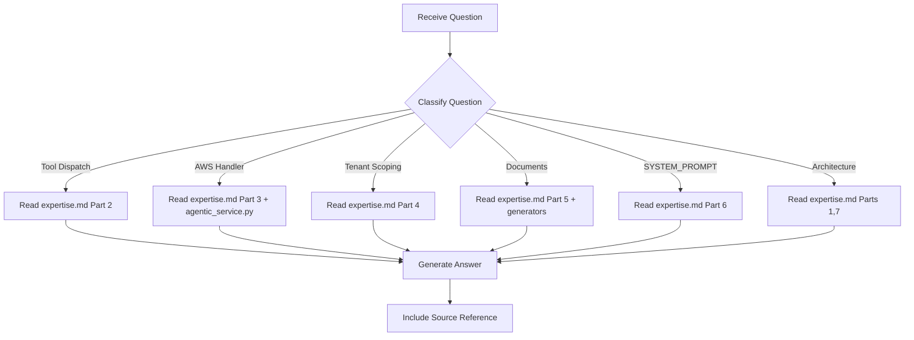

# Backend Expert - Question Mode

> Read-only command to query backend knowledge without making any changes.

## Purpose

Answer questions about the EAGLE Agentic Service backend — tool dispatch, AWS handlers, document generation, tenant scoping, SYSTEM_PROMPT — **without making any code changes**.

## Usage

```
/experts:backend:question [question]
```

## Allowed Tools

`Read`, `Glob`, `Grep`, `Bash` (read-only commands only)

## Question Categories

### Category 1: Tool Dispatch Questions

Questions about how tools are routed and executed.

**Examples**:
- "How does execute_tool() work?"
- "Which tools need session_id?"
- "What happens when an unknown tool is called?"

**Resolution**:
1. Read `.claude/commands/experts/backend/expertise.md` -> Part 2
2. If needed, read `app/agentic_service.py` lines 2167-2201
3. Provide formatted answer

---

### Category 2: AWS Handler Questions

Questions about specific tool handler implementations.

**Examples**:
- "What actions does s3_document_ops support?"
- "What's the DynamoDB key schema?"
- "How does create_document save to S3?"

**Resolution**:
1. Read `.claude/commands/experts/backend/expertise.md` -> Part 3
2. If needed, read `app/agentic_service.py` at the handler's line number
3. Provide answer with code references

---

### Category 3: Tenant Scoping Questions

Questions about multi-tenant isolation and user scoping.

**Examples**:
- "How does tenant_id get resolved?"
- "What's the S3 prefix for a WebSocket session?"
- "How are DynamoDB items scoped per tenant?"

**Resolution**:
1. Read `.claude/commands/experts/backend/expertise.md` -> Part 4
2. Provide answer with key pattern examples

---

### Category 4: Document Generation Questions

Questions about the 10 document types and their generators.

**Examples**:
- "What document types are available?"
- "What fields does _generate_sow() use?"
- "How are documents saved to S3?"

**Resolution**:
1. Read `.claude/commands/experts/backend/expertise.md` -> Part 5
2. If needed, read `app/agentic_service.py` at the generator's line number
3. Provide answer with field details

---

### Category 5: SYSTEM_PROMPT Questions

Questions about the agent's system prompt and behavior.

**Examples**:
- "What are the five intake phases?"
- "What specialist lenses does EAGLE use?"
- "What are the key acquisition thresholds?"

**Resolution**:
1. Read `.claude/commands/experts/backend/expertise.md` -> Part 6
2. If needed, read `app/agentic_service.py` lines 25-115
3. Provide structured answer

---

### Category 6: Architecture Questions

Questions about the overall backend architecture and patterns.

**Examples**:
- "How does stream_chat() handle tool calls?"
- "What's the Bedrock toggle?"
- "How are AWS clients initialized?"

**Resolution**:
1. Read `.claude/commands/experts/backend/expertise.md` -> Part 1 and Part 7
2. If needed, read `app/agentic_service.py` for specific implementations
3. Provide answer with flow diagrams if helpful

---

## Workflow



---

## Report Format

```markdown
## Answer

{Direct answer to the question}

## Details

{Supporting information from expertise.md or source files}

## Source

- expertise.md -> {section}
- app/agentic_service.py:{line} (if referenced)
```

---

## Instructions

1. **Read expertise.md first** - All knowledge is stored there
2. **Never modify files** - This is a read-only command
3. **Be specific** - Reference exact sections and line numbers
4. **Suggest next steps** - If appropriate, suggest what command to run next
