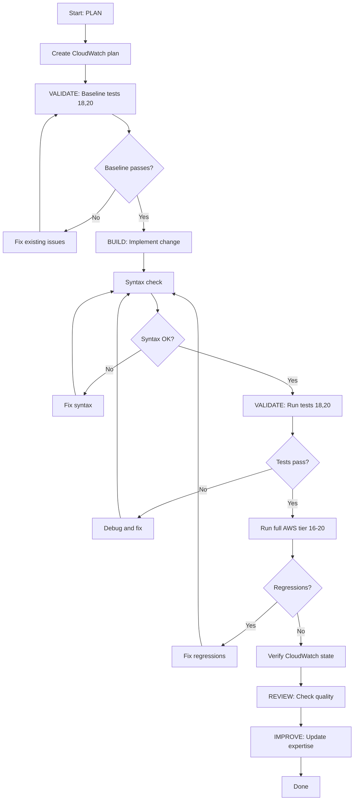

# CloudWatch Expert - Plan Build Improve Workflow

> Full ACT-LEARN-REUSE workflow for CloudWatch telemetry development.

## Purpose

Execute the complete CloudWatch development workflow:
1. **PLAN** - Design changes using expertise
2. **VALIDATE (baseline)** - Run CloudWatch tests, capture baseline
3. **BUILD** - Implement the changes
4. **VALIDATE (post)** - Run tests, verify no regressions
5. **REVIEW** - Check quality and correctness
6. **IMPROVE** - Update expertise with learnings

## Usage

```
/experts:cloudwatch:plan_build_improve [description of CloudWatch change]
```

## Variables

- `TASK`: $ARGUMENTS

## Allowed Tools

`Read`, `Write`, `Edit`, `Glob`, `Grep`, `Bash`

---

## Workflow

### Step 1: PLAN (Context Loading)

1. Read `.claude/commands/experts/cloudwatch/expertise.md` for:
   - Log group structure and stream naming
   - Event schemas and invariants
   - Emission pipeline details
   - boto3 API patterns
   - Known issues

2. Analyze the TASK:
   - Search codebase for relevant implementations
   - Determine which files are affected
   - Identify boto3 API dependencies

3. Create plan:
   - Write to `.claude/specs/cloudwatch-{feature}.md`
   - Include impact analysis
   - Include verification steps

---

### Step 2: VALIDATE (Baseline)

1. Run pre-change validation:
   ```bash
   # Syntax check
   python -c "import py_compile; py_compile.compile('server/tests/test_eagle_sdk_eval.py', doraise=True)"

   # Run CloudWatch-related tests (free, no LLM cost)
   python server/tests/test_eagle_sdk_eval.py --model haiku --tests 18,20
   ```

2. Save baseline: Note pass/fail for tests 18 and 20

3. **STOP if baseline fails** -- Fix existing issues first

4. Optionally check current CloudWatch state:
   ```bash
   aws logs describe-log-streams \
     --log-group-name /eagle/test-runs \
     --order-by LastEventTime \
     --descending \
     --limit 3
   ```

---

### Step 3: BUILD (Implement Changes)

Depending on the task type:

#### Schema Change
1. Update event construction in `emit_to_cloudwatch()` (~line 2248-2298)
2. Update test 20 validation logic if event structure changed
3. Verify run_summary invariant is preserved

#### Emission Pipeline Change
1. Modify `emit_to_cloudwatch()` (~line 2224-2311)
2. Ensure non-fatal error handling is preserved
3. Ensure events remain sorted by timestamp

#### Tool Change
1. Modify `_exec_cloudwatch_logs()` (~line 589-705)
2. Update test 18 if operation signatures changed
3. Ensure error handling covers new code paths

#### Infrastructure Change
1. Update log group/stream naming if needed
2. Update `LOG_GROUP` constant (~line 2222)
3. Update all references

Keep changes atomic and focused.

---

### Step 4: VALIDATE (Post-Implementation)

1. Run post-change validation:
   ```bash
   # Syntax check
   python -c "import py_compile; py_compile.compile('server/tests/test_eagle_sdk_eval.py', doraise=True)"

   # Run CloudWatch tests
   python server/tests/test_eagle_sdk_eval.py --model haiku --tests 18,20

   # Run full AWS tier to check for regressions
   python server/tests/test_eagle_sdk_eval.py --model haiku --tests 16,17,18,19,20
   ```

2. Compare to baseline:
   - Tests 18 and 20 still pass?
   - No regressions in other AWS tests?
   - CloudWatch emission confirmation printed?

3. Verify CloudWatch state:
   ```bash
   # Check latest stream was created
   aws logs describe-log-streams \
     --log-group-name /eagle/test-runs \
     --order-by LastEventTime \
     --descending \
     --limit 1

   # Read events from latest stream
   aws logs get-log-events \
     --log-group-name /eagle/test-runs \
     --log-stream-name "STREAM_NAME_HERE" \
     --start-from-head
   ```

4. If validation passes: proceed to review
5. If validation fails: fix and re-run

---

### Step 5: REVIEW

1. Review changes:
   - Does the emission remain non-fatal?
   - Are events still sorted by timestamp?
   - Is the run_summary invariant preserved?
   - Are new error paths handled?

2. Check for:
   - No hardcoded timestamps or stream names
   - Proper exception handling (catch-all preserved)
   - Message size within 256 KB limit
   - Event timestamps in milliseconds

3. Verify backward compatibility:
   - Can test 20 still read old streams?
   - Can the tool still query existing data?

---

### Step 6: IMPROVE (Self-Improve)

1. Determine outcome:
   - **success**: All CloudWatch tests pass, emission confirmed
   - **partial**: Some tests pass, emission may have issues
   - **failed**: CloudWatch tests fail

2. Update `.claude/commands/experts/cloudwatch/expertise.md`:
   - Add to `patterns_that_work`
   - Add to `patterns_to_avoid`
   - Document any `common_issues`
   - Add helpful `tips`
   - Update relevant Parts if schemas/APIs changed

3. Update `last_updated` timestamp

---

## Decision Points



---

## Report Format

```markdown
## CloudWatch Development Complete: {TASK}

### Summary

| Phase | Status | Notes |
|-------|--------|-------|
| Plan | DONE | .claude/specs/cloudwatch-{feature}.md |
| Baseline | PASS | Tests 18, 20 green |
| Build | DONE | {description of change} |
| Validation | PASS | No regressions |
| Review | PASS | Non-fatal preserved, invariants hold |
| Improve | DONE | Expertise updated |

### Changes Made

| File | Change | Line |
|------|--------|------|
| {file} | {description} | ~{line} |

### CloudWatch Verification

- Log group: /eagle/test-runs
- Latest stream: {stream name}
- Events emitted: {count}
- run_summary: {passed}P {failed}F {skipped}S

### Learnings Captured

- Pattern: {what worked}
- Tip: {useful observation}
```

---

## Instructions

1. **Follow the workflow order** - Don't skip validation steps
2. **Stop on failures** - Fix before proceeding
3. **Preserve non-fatal emission** - Never let CloudWatch crash the test suite
4. **Maintain event ordering** - Sort by timestamp before put_log_events
5. **Check the invariant** - passed + skipped + failed == total_tests
6. **Test with 18 AND 20** - Test 18 validates the tool; test 20 validates emission
7. **Always improve** - Even failed attempts have learnings
