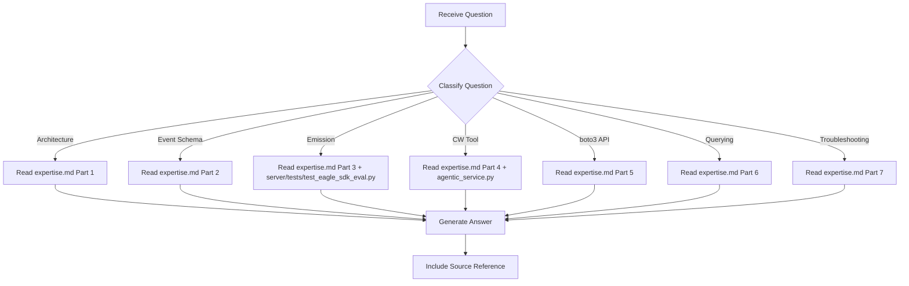

# CloudWatch Expert - Question Mode

> Read-only command to query CloudWatch knowledge without making any changes.

## Purpose

Answer questions about CloudWatch Logs telemetry in this project -- event schemas, emission pipeline, boto3 API patterns, querying techniques -- **without making any code changes**.

## Usage

```
/experts:cloudwatch:question [question]
```

## Allowed Tools

`Read`, `Glob`, `Grep`, `Bash` (read-only commands only)

## Question Categories

### Category 1: Architecture Questions

Questions about the CloudWatch log group structure and event flow.

**Examples**:
- "How are test runs organized in CloudWatch?"
- "What log group do eval results go to?"
- "How are stream names generated?"

**Resolution**:
1. Read `.claude/commands/experts/cloudwatch/expertise.md` -> Part 1 (Architecture)
2. If needed, read `server/tests/test_eagle_sdk_eval.py` (~line 2222-2250) for stream naming
3. Provide formatted answer

---

### Category 2: Event Schema Questions

Questions about the test_result and run_summary event formats.

**Examples**:
- "What fields are in a test_result event?"
- "How is pass_rate calculated?"
- "What status values are possible?"

**Resolution**:
1. Read `.claude/commands/experts/cloudwatch/expertise.md` -> Part 2 (Event Schemas)
2. Provide answer with JSON examples

---

### Category 3: Emission Pipeline Questions

Questions about how test results get to CloudWatch.

**Examples**:
- "How does emit_to_cloudwatch work?"
- "What happens if CloudWatch is unreachable?"
- "Why are events sorted by timestamp?"

**Resolution**:
1. Read `.claude/commands/experts/cloudwatch/expertise.md` -> Part 3 (Emission Pipeline)
2. If needed, read `server/tests/test_eagle_sdk_eval.py` (~line 2224-2311) for implementation
3. Provide answer with code references

---

### Category 4: CloudWatch Tool Questions

Questions about the _exec_cloudwatch_logs tool in agentic_service.py.

**Examples**:
- "What operations does the CloudWatch tool support?"
- "How do I search for failures?"
- "What's the default log group?"

**Resolution**:
1. Read `.claude/commands/experts/cloudwatch/expertise.md` -> Part 4 (CloudWatch Logs Tool)
2. If needed, read `server/app/agentic_service.py` (~line 589-705) for implementation
3. Provide answer with param tables and return shapes

---

### Category 5: boto3 API Questions

Questions about the underlying AWS SDK calls.

**Examples**:
- "Which boto3 APIs are used?"
- "How does put_log_events work?"
- "What's the difference between get_log_events and filter_log_events?"

**Resolution**:
1. Read `.claude/commands/experts/cloudwatch/expertise.md` -> Part 5 (boto3 API Patterns)
2. Provide answer with code examples

---

### Category 6: Querying and Analysis Questions

Questions about how to query and analyze test run data.

**Examples**:
- "How do I find the most recent run?"
- "How do I find all failures in the last 24 hours?"
- "How do I aggregate pass rates?"

**Resolution**:
1. Read `.claude/commands/experts/cloudwatch/expertise.md` -> Part 6 (Querying and Analysis)
2. Provide answer with code examples and AWS CLI equivalents

---

### Category 7: Troubleshooting Questions

Questions about CloudWatch issues and known problems.

**Examples**:
- "Why did test 20 fail even though the run looked good?"
- "Why is the search operation returning unexpected results?"
- "CloudWatch emission says non-fatal, what happened?"

**Resolution**:
1. Read `.claude/commands/experts/cloudwatch/expertise.md` -> Part 7 (Known Issues)
2. Provide diagnosis and workaround

---

## Workflow



---

## Report Format

```markdown
## Answer

{Direct answer to the question}

## Details

{Supporting information from expertise.md or source files}

## Source

- expertise.md -> {section}
- server/tests/test_eagle_sdk_eval.py:{line} (if referenced)
- server/app/agentic_service.py:{line} (if referenced)
```

---

## Instructions

1. **Read expertise.md first** - All knowledge is stored there
2. **Never modify files** - This is a read-only command
3. **Be specific** - Reference exact sections and line numbers
4. **Suggest next steps** - If appropriate, suggest what command to run next
