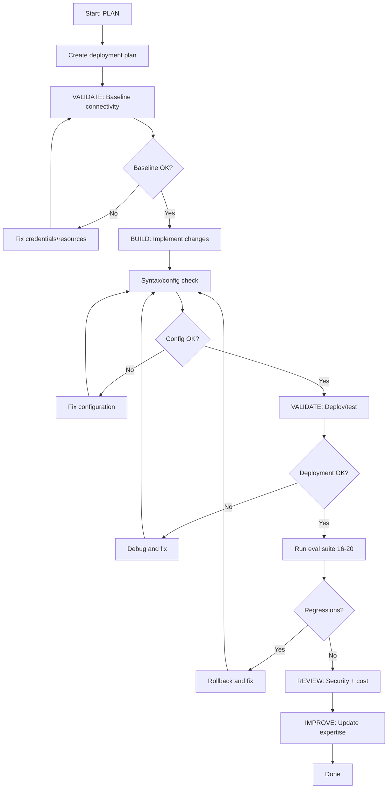

# Deployment Expert - Plan Build Improve Workflow

> Full ACT-LEARN-REUSE workflow for infrastructure and deployment development.

## Purpose

Execute the complete infrastructure development workflow:
1. **PLAN** - Design infrastructure changes using expertise
2. **VALIDATE (baseline)** - Check current AWS connectivity and resource state
3. **BUILD** - Implement the infrastructure changes
4. **VALIDATE (post)** - Verify deployment and check for issues
5. **REVIEW** - Confirm resource state and security
6. **IMPROVE** - Update expertise with learnings

## Usage

```
/experts:deployment:plan_build_improve add CDK stack for storage resources
/experts:deployment:plan_build_improve deploy Next.js to CloudFront
/experts:deployment:plan_build_improve set up GitHub Actions CI/CD
```

## Variables

- `TASK`: $ARGUMENTS

## Allowed Tools

`Read`, `Write`, `Edit`, `Glob`, `Grep`, `Bash`

---

## Workflow

### Step 1: PLAN (Context Loading)

1. Read `.claude/commands/experts/deployment/expertise.md` for:
   - Current infrastructure state
   - AWS resources inventory
   - CDK patterns and naming conventions
   - Known issues and workarounds

2. Analyze the TASK:
   - Search codebase for relevant files
   - Identify which AWS services are involved
   - Determine if existing resources need importing
   - Check for potential conflicts

3. Create deployment plan:
   - Write to `.claude/specs/deployment-{feature}.md`
   - Include prerequisites checklist
   - Include rollback plan
   - Include cost estimate

---

### Step 2: VALIDATE (Baseline)

1. Run pre-change validation:
   ```bash
   # Check AWS connectivity
   python -c "
   import boto3, json
   results = []

   # STS Identity
   try:
       sts = boto3.client('sts', region_name='us-east-1')
       identity = sts.get_caller_identity()
       results.append(('AWS Identity', 'OK', f'Account: {identity[\"Account\"]}'))
   except Exception as e:
       results.append(('AWS Identity', 'FAIL', str(e)[:60]))

   # S3
   try:
       s3 = boto3.client('s3', region_name='us-east-1')
       s3.head_bucket(Bucket='nci-documents')
       results.append(('S3 nci-documents', 'OK', 'Accessible'))
   except Exception as e:
       results.append(('S3 nci-documents', 'FAIL', str(e)[:60]))

   # DynamoDB
   try:
       ddb = boto3.client('dynamodb', region_name='us-east-1')
       resp = ddb.describe_table(TableName='eagle')
       results.append(('DynamoDB eagle', 'OK', resp['Table']['TableStatus']))
   except Exception as e:
       results.append(('DynamoDB eagle', 'FAIL', str(e)[:60]))

   # CloudWatch
   try:
       logs = boto3.client('logs', region_name='us-east-1')
       resp = logs.describe_log_groups(logGroupNamePrefix='/eagle/test-runs')
       found = any(g['logGroupName'] == '/eagle/test-runs' for g in resp.get('logGroups', []))
       results.append(('CloudWatch', 'OK' if found else 'MISSING', '/eagle/test-runs'))
   except Exception as e:
       results.append(('CloudWatch', 'FAIL', str(e)[:60]))

   print('Baseline Check')
   print('=' * 55)
   for name, status, detail in results:
       print(f'  {name:25s} {status:6s} {detail}')
   ok = sum(1 for _, s, _ in results if s == 'OK')
   print(f'  Summary: {ok}/{len(results)} services OK')
   "
   ```

2. Save baseline: Note current resource state

3. **STOP if baseline fails** — Fix connectivity/credential issues first

---

### Step 3: BUILD (Implement Changes)

1. Implement infrastructure changes based on the plan:
   - Create CDK stacks, Dockerfiles, GitHub Actions, or configuration
   - Follow patterns from expertise.md
   - Use environment-specific naming

2. Key implementation rules:
   - **Import existing resources** — Never recreate `nci-documents` bucket or `eagle` table
   - **Tag everything** — `Project=eagle`, `Environment={env}`, `ManagedBy=cdk`
   - **Use OIDC for CI/CD** — No static IAM keys in GitHub Actions
   - **Set HOSTNAME=0.0.0.0** — Required for containerized Next.js in ECS
   - **Include rollback commands** — Comment them in deployment scripts

3. Keep changes atomic and focused on the TASK

---

### Step 4: VALIDATE (Post-Implementation)

1. Run post-change validation:
   ```bash
   # Re-run connectivity check (same as baseline)
   python -c "
   import boto3
   sts = boto3.client('sts', region_name='us-east-1')
   identity = sts.get_caller_identity()
   print(f'AWS Identity OK: {identity[\"Account\"]}')
   "
   ```

2. Validate specific to the change type:

   **CDK Stack**:
   ```bash
   cd cdk && npx cdk synth   # Synthesis check (no deploy)
   cd cdk && npx cdk diff    # Show what would change
   ```

   **Docker Build**:
   ```bash
   docker build -t eagle-frontend .
   docker run -p 3000:3000 --rm eagle-frontend &
   curl -f http://localhost:3000/ || echo "Health check failed"
   ```

   **GitHub Actions**:
   ```bash
   # Validate workflow syntax
   python -c "import yaml; yaml.safe_load(open('.github/workflows/deploy.yml')); print('YAML valid')"
   ```

   **Static Export**:
   ```bash
   cd client && npm run build
   ls out/index.html || echo "Export failed"
   ```

3. Run eval suite to check nothing is broken:
   ```bash
   python server/tests/test_eagle_sdk_eval.py --model haiku --tests 16,17,18,19,20
   ```

4. Compare to baseline:
   - All baseline services still OK?
   - New resources created correctly?
   - No unexpected side effects?

5. If validation passes: proceed to review

6. If validation fails: fix and re-validate

---

### Step 5: REVIEW

1. Review changes:
   - Do resources follow naming conventions? (`eagle-{component}-{env}`)
   - Are existing resources imported (not recreated)?
   - Are all resources tagged?
   - Is the rollback plan documented?

2. Security review:
   - No secrets hardcoded (use environment variables or SSM Parameter Store)
   - IAM policies follow least privilege
   - S3 buckets block public access (unless intentional for static site)
   - OIDC used instead of static keys for CI/CD

3. Cost review:
   - Estimated monthly cost documented
   - No unexpected expensive resources (NAT gateways, large Fargate tasks)
   - Cleanup commands available for dev resources

---

### Step 6: IMPROVE (Self-Improve)

1. Determine outcome:
   - **success**: All validation passes, resources deployed
   - **partial**: Some components work, others need fixes
   - **failed**: Deployment did not succeed

2. Update `.claude/commands/experts/deployment/expertise.md`:
   - Add to `patterns_that_work`
   - Add to `patterns_to_avoid`
   - Document any `common_issues`
   - Add helpful `tips`
   - Update resource inventory if new resources exist
   - Update `last_updated` timestamp

---

## Decision Points



---

## Report Format

```markdown
## Deployment Complete: {TASK}

### Summary

| Phase | Status | Notes |
|-------|--------|-------|
| Plan | DONE | .claude/specs/deployment-{feature}.md |
| Baseline | PASS | {N} services OK |
| Build | DONE | {description of what was built} |
| Validation | PASS | No regressions |
| Review | PASS | Security and cost approved |
| Improve | DONE | Expertise updated |

### Resources Created/Modified

| Resource | Type | Name | Action |
|----------|------|------|--------|
| S3 Bucket | Import | nci-documents | Referenced (not managed) |
| CloudFront | Create | eagle-cdn-dev | New distribution |

### Cost Impact

| Resource | Monthly Estimate |
|----------|-----------------|
| {resource} | ~${amount} |

### Eval Suite Health

| Tier | Status |
|------|--------|
| AWS Tools (16-20) | PASS |

### Learnings Captured

- Pattern: {what worked}
- Tip: {useful observation}
```

---

## Instructions

1. **Follow the workflow order** - Don't skip validation steps
2. **Stop on failures** - Fix before proceeding
3. **Import existing resources** - Never recreate S3 bucket or DynamoDB table
4. **Always run eval suite** - Tests 16-20 verify AWS connectivity still works
5. **Always improve** - Even failed deployments have learnings
6. **Include rollback plan** - Every deployment needs an undo path
7. **Tag everything** - Project, Environment, ManagedBy
