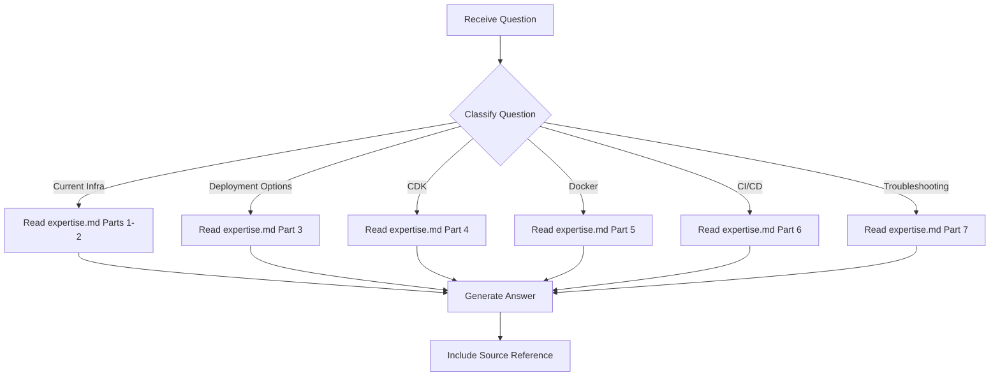

# Deployment Expert - Question Mode

> Read-only command to query deployment and infrastructure knowledge without making any changes.

## Purpose

Answer questions about AWS infrastructure, deployment options, CDK patterns, Docker, CI/CD, and the current EAGLE platform resources — **without making any code or infrastructure changes**.

## Usage

```
/experts:deployment:question [question]
```

## Allowed Tools

`Read`, `Glob`, `Grep`, `Bash` (read-only commands only)

## Question Categories

### Category 1: Current Infrastructure Questions

Questions about what AWS resources exist and how they are configured.

**Examples**:
- "What S3 bucket does the project use?"
- "What is the DynamoDB key schema?"
- "How are AWS credentials configured?"
- "What region are resources in?"

**Resolution**:
1. Read `.claude/commands/experts/deployment/expertise.md` -> Part 1 and Part 2
2. If needed, check `app/agentic_service.py` for resource references
3. Provide formatted answer

---

### Category 2: Deployment Options Questions

Questions about how to deploy the Next.js frontend or backend services.

**Examples**:
- "Should I use S3+CloudFront or ECS for the frontend?"
- "How do I deploy the Next.js app?"
- "What is the standalone output mode?"

**Resolution**:
1. Read `.claude/commands/experts/deployment/expertise.md` -> Part 3
2. Provide comparison table or recommendation
3. Reference decision criteria

---

### Category 3: CDK Questions

Questions about infrastructure-as-code patterns and CDK setup.

**Examples**:
- "How would I structure a CDK project for this?"
- "How do I import the existing DynamoDB table into CDK?"
- "What naming conventions should CDK stacks use?"

**Resolution**:
1. Read `.claude/commands/experts/deployment/expertise.md` -> Part 4
2. Provide code examples from nci-oa-agent patterns
3. Note any known issues (Part 7)

---

### Category 4: Docker Questions

Questions about containerizing the application.

**Examples**:
- "How do I write a Dockerfile for the Next.js frontend?"
- "What is the HOSTNAME issue with ECS?"
- "How do multi-stage builds work?"

**Resolution**:
1. Read `.claude/commands/experts/deployment/expertise.md` -> Part 5
2. Provide Dockerfile examples
3. Highlight ECS-specific requirements

---

### Category 5: CI/CD Questions

Questions about automated deployment pipelines.

**Examples**:
- "How do I set up GitHub Actions with OIDC?"
- "What does the deployment workflow look like?"
- "How do I push Docker images to ECR from CI?"

**Resolution**:
1. Read `.claude/commands/experts/deployment/expertise.md` -> Part 6
2. Provide workflow YAML examples
3. Include IAM trust policy if relevant

---

### Category 6: Troubleshooting Questions

Questions about deployment failures or infrastructure issues.

**Examples**:
- "CDK deploy fails with an asset error — what do I do?"
- "Next.js container is unreachable in ECS — why?"
- "S3 static site returns 403 for deep links — how to fix?"

**Resolution**:
1. Read `.claude/commands/experts/deployment/expertise.md` -> Part 7
2. Provide diagnosis and solution
3. Include commands to verify the fix

---

## Workflow



---

## Report Format

```markdown
## Answer

{Direct answer to the question}

## Details

{Supporting information from expertise.md or source files}

## Source

- expertise.md -> {section}
- app/agentic_service.py:{line} (if referenced)
- nextjs-frontend/next.config.{ts,js} (if referenced)
```

---

## Instructions

1. **Read expertise.md first** - All knowledge is stored there
2. **Never modify files** - This is a read-only command
3. **Be specific** - Reference exact sections and provide code examples
4. **Suggest next steps** - If appropriate, suggest what command to run next (e.g., `/experts:deployment:plan` for implementation)
