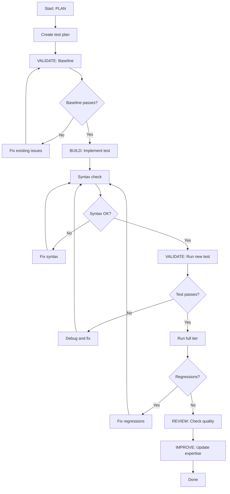

# Eval Expert - Plan Build Improve Workflow

> Full ACT-LEARN-REUSE workflow for eval suite development.

## Purpose

Execute the complete eval development workflow:
1. **PLAN** - Design new test(s) using expertise
2. **VALIDATE (baseline)** - Run existing suite, capture baseline
3. **BUILD** - Implement the test(s)
4. **VALIDATE (post)** - Run suite, verify no regressions
5. **REVIEW** - Check test quality
6. **IMPROVE** - Update expertise with learnings

## Usage

```
/experts:eval:plan_build_improve [test description or feature]
```

## Variables

- `TASK`: $ARGUMENTS

## Allowed Tools

`Read`, `Write`, `Edit`, `Glob`, `Grep`, `Bash`

---

## Workflow

### Step 1: PLAN (Context Loading)

1. Read `expertise.md` for:
   - Test architecture and patterns
   - AWS tool interfaces
   - Known issues

2. Analyze the TASK:
   - Search codebase for relevant implementations
   - Identify which tier the test belongs to
   - Determine dependencies

3. Create test plan:
   - Write to `.claude/specs/eval-{feature}.md`
   - Include registration checklist
   - Include cleanup strategy

---

### Step 2: VALIDATE (Baseline)

1. Run pre-change validation:
   ```bash
   # Syntax check
   python -c "import py_compile; py_compile.compile('test_eagle_sdk_eval.py', doraise=True)"

   # Run existing AWS tool tests (fast, no LLM cost)
   python test_eagle_sdk_eval.py --model haiku --tests 16,17,18,19,20
   ```

2. Save baseline: Note pass/fail counts from `trace_logs.json`

3. **STOP if baseline fails** — Fix existing issues first

---

### Step 3: BUILD (Implement Tests)

1. Implement test function(s) in `test_eagle_sdk_eval.py`:
   - Follow the async test function pattern
   - Include step-by-step progress printing
   - Add boto3 confirmation for AWS tests
   - Include cleanup

2. Update all registrations:
   - `TEST_REGISTRY` in `_run_test()`
   - `test_names` in `emit_to_cloudwatch()`
   - `result_key` mapping in `main()` trace output
   - Summary printout in `main()`
   - Default range if needed
   - Docstring if test count changes

3. Keep changes atomic

---

### Step 4: VALIDATE (Post-Implementation)

1. Run post-change validation:
   ```bash
   # Syntax check
   python -c "import py_compile; py_compile.compile('test_eagle_sdk_eval.py', doraise=True)"

   # Run new test(s) in isolation
   python test_eagle_sdk_eval.py --model haiku --tests {N}

   # Run full AWS tier to check for regressions
   python test_eagle_sdk_eval.py --model haiku --tests 16,17,18,19,20
   ```

2. Compare to baseline:
   - All baseline tests still pass?
   - New test(s) pass?
   - No artifacts left behind?

3. If validation passes: proceed to review

4. If validation fails: fix and re-run

---

### Step 5: REVIEW

1. Review changes:
   - Does the test follow existing patterns?
   - Is cleanup comprehensive?
   - Are assertions specific enough?
   - Is the test idempotent?

2. Check for:
   - All 6 registration points updated
   - Proper error handling
   - No hardcoded AWS resource names (use variables)
   - boto3 confirmation present for AWS tests

---

### Step 6: IMPROVE (Self-Improve)

1. Determine outcome:
   - **success**: All tests pass
   - **partial**: Some tests pass
   - **failed**: New test fails

2. Update `expertise.md`:
   - Add to `patterns_that_work`
   - Add to `patterns_to_avoid`
   - Document any `common_issues`
   - Add helpful `tips`

3. Update `last_updated` timestamp

---

## Decision Points



---

## Report Format

```markdown
## Eval Development Complete: {TASK}

### Summary

| Phase | Status | Notes |
|-------|--------|-------|
| Plan | DONE | .claude/specs/eval-{feature}.md |
| Baseline | PASS | {N} tests green |
| Build | DONE | Test {N} implemented |
| Validation | PASS | No regressions |
| Review | PASS | Follows patterns |
| Improve | DONE | Expertise updated |

### New Test(s)

| # | Name | Status | Type |
|---|------|--------|------|
| {N} | {name} | PASS | AWS Tool Integration |

### Registration Points Updated

- [x] TEST_REGISTRY
- [x] test_names
- [x] result_key mapping
- [x] Summary printout
- [x] Default range
- [x] Docstring

### Learnings Captured

- Pattern: {what worked}
- Tip: {useful observation}
```

---

## Instructions

1. **Follow the workflow order** - Don't skip validation steps
2. **Stop on failures** - Fix before proceeding
3. **Keep atomic** - One test or related group per workflow
4. **Always improve** - Even failed attempts have learnings
5. **Verify all 6 registration points** - Missing one breaks the suite
6. **Test cleanup** - Run twice to confirm idempotency
