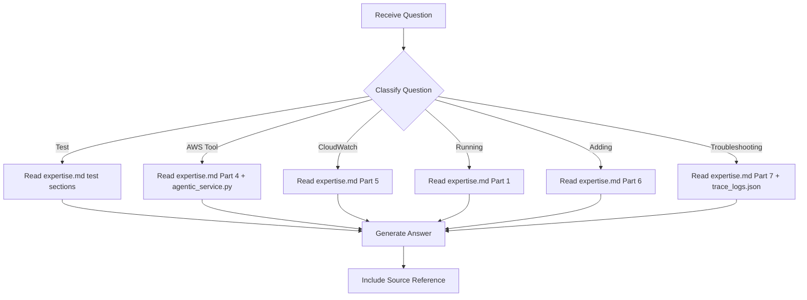

# Eval Expert - Question Mode

> Read-only command to query eval suite knowledge without making any changes.

## Purpose

Answer questions about the EAGLE SDK Evaluation Suite — tests, patterns, AWS tools, CloudWatch telemetry, skill validation — **without making any code changes**.

## Usage

```
/experts:eval:question [question]
```

## Allowed Tools

`Read`, `Glob`, `Grep`, `Bash` (read-only commands only)

## Question Categories

### Category 1: Test Questions

Questions about specific tests or test tiers.

**Examples**:
- "What does test 17 do?"
- "Which tests use LLM calls?"
- "What's the difference between tests 1-6 and 16-20?"

**Resolution**:
1. Read `expertise.md` -> relevant test tier section
2. If needed, read `test_eagle_sdk_eval.py` for exact implementation
3. Provide formatted answer

---

### Category 2: AWS Tool Questions

Questions about the AWS tools being tested.

**Examples**:
- "How does execute_tool work?"
- "What S3 bucket do the tests use?"
- "What's the DynamoDB key schema?"

**Resolution**:
1. Read `expertise.md` -> Part 4 (AWS Tool Integration)
2. If needed, read `app/agentic_service.py` for tool implementations
3. Provide answer with code references

---

### Category 3: CloudWatch Telemetry Questions

Questions about test telemetry and reporting.

**Examples**:
- "Where do test results go in CloudWatch?"
- "What's the event schema?"
- "How does emit_to_cloudwatch work?"

**Resolution**:
1. Read `expertise.md` -> Part 5 (CloudWatch Telemetry)
2. Provide structured answer

---

### Category 4: Running Tests Questions

Questions about how to run and configure the suite.

**Examples**:
- "How do I run just the AWS tests?"
- "What CLI flags are available?"
- "How do I run tests in parallel?"

**Resolution**:
1. Read `expertise.md` -> Part 1 (CLI Interface)
2. Provide command examples

---

### Category 5: Adding Tests Questions

Questions about extending the test suite.

**Examples**:
- "How do I add a new test?"
- "What needs to be updated for a new test?"
- "What naming convention do tests follow?"

**Resolution**:
1. Read `expertise.md` -> Part 6 (Test Patterns)
2. Provide checklist of required changes

---

### Category 6: Troubleshooting Questions

Questions about failures or unexpected behavior.

**Examples**:
- "Why did test 16 fail?"
- "What causes MCP race conditions?"
- "Why does tenant_id always resolve to demo-tenant?"

**Resolution**:
1. Read `expertise.md` -> Part 7 (Known Issues)
2. Check `trace_logs.json` if available
3. Provide diagnosis and solution

---

## Workflow



---

## Report Format

```markdown
## Answer

{Direct answer to the question}

## Details

{Supporting information from expertise.md or source files}

## Source

- expertise.md -> {section}
- test_eagle_sdk_eval.py:{line} (if referenced)
- app/agentic_service.py:{line} (if referenced)
```

---

## Instructions

1. **Read expertise.md first** - All knowledge is stored there
2. **Never modify files** - This is a read-only command
3. **Be specific** - Reference exact sections and line numbers
4. **Suggest next steps** - If appropriate, suggest what command to run next
