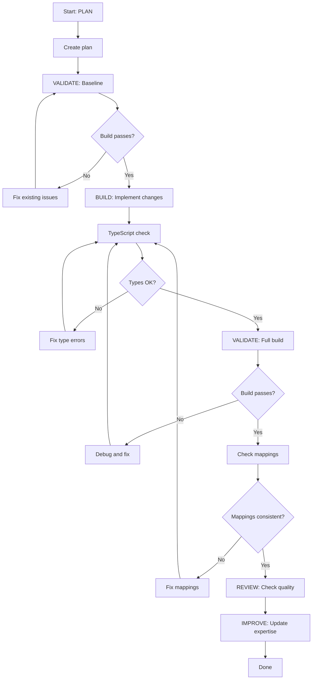

# Frontend Expert - Plan Build Improve Workflow

> Full ACT-LEARN-REUSE workflow for frontend development.

## Purpose

Execute the complete frontend development workflow:
1. **PLAN** - Design changes using expertise
2. **VALIDATE (baseline)** - Check current build, verify mappings
3. **BUILD** - Implement the changes
4. **VALIDATE (post)** - Build check, verify no regressions
5. **REVIEW** - Check quality and consistency
6. **IMPROVE** - Update expertise with learnings

## Usage

```
/experts:frontend:plan_build_improve [feature description or change]
```

## Variables

- `TASK`: $ARGUMENTS

## Allowed Tools

`Read`, `Write`, `Edit`, `Glob`, `Grep`, `Bash`

---

## Workflow

### Step 1: PLAN (Context Loading)

1. Read `.claude/commands/experts/frontend/expertise.md` for:
   - Architecture and patterns
   - Component structure
   - Test result mappings
   - Known issues

2. Analyze the TASK:
   - Search codebase for relevant components
   - Identify affected files
   - Determine dependencies

3. Create plan:
   - Write to `.claude/specs/frontend-{feature}.md`
   - Include file list, component design, mapping updates
   - Include verification steps

---

### Step 2: VALIDATE (Baseline)

1. Run pre-change validation:
   ```bash
   # TypeScript build check
   cd client && npx tsc --noEmit 2>&1 | tail -20

   # Check current mapping counts
   grep -c "'" client/app/admin/tests/page.tsx   # TEST_NAMES entries
   grep -c "id:" test_results_dashboard.html              # TEST_DEFS entries
   ```

2. Note baseline: Current build status, mapping counts

3. **STOP if baseline fails** -- Fix existing issues first

---

### Step 3: BUILD (Implement Changes)

1. Implement changes following existing patterns:
   - Use `'use client'` for interactive components
   - Wrap protected pages with `<AuthGuard>`
   - Include `<TopNav />` on admin pages
   - Use Tailwind classes from the NCI palette
   - Follow existing interface patterns

2. Update all required registrations if adding tests:
   - `TEST_NAMES` in `client/app/admin/tests/page.tsx`
   - `TEST_DEFS` in `test_results_dashboard.html`
   - `SKILL_TEST_MAP` in `client/app/admin/viewer/page.tsx` (if applicable)
   - Readiness panel in `test_results_dashboard.html`

3. Keep changes atomic

---

### Step 4: VALIDATE (Post-Implementation)

1. Run post-change validation:
   ```bash
   # TypeScript build check
   cd client && npx tsc --noEmit 2>&1 | tail -20

   # Full build
   cd client && npm run build 2>&1 | tail -30

   # Check mapping consistency
   grep "'[0-9]'" client/app/admin/tests/page.tsx | wc -l
   grep "id:" test_results_dashboard.html | grep -c "category"
   ```

2. Compare to baseline:
   - Build still passes?
   - Mapping counts correct?
   - No TypeScript errors?

3. If validation passes: proceed to review

4. If validation fails: fix and re-run

---

### Step 5: REVIEW

1. Review changes:
   - Does the component follow existing patterns?
   - Are TypeScript interfaces properly defined?
   - Is Tailwind styling consistent with the theme?
   - Are all mappings updated in both frontends?

2. Check for:
   - `'use client'` directive present on interactive pages
   - AuthGuard wrapping protected pages
   - Proper error states (loading, error, empty)
   - Responsive layout considerations
   - Consistent icon usage (lucide-react)

---

### Step 6: IMPROVE (Self-Improve)

1. Determine outcome:
   - **success**: Build passes, all changes working
   - **partial**: Some changes work, some need fixes
   - **failed**: Build broken or changes not working

2. Update `.claude/commands/experts/frontend/expertise.md`:
   - Add to `patterns_that_work`
   - Add to `patterns_to_avoid`
   - Document any `common_issues`
   - Add helpful `tips`
   - Update component tree if new components added
   - Update route table if new pages added

3. Update `last_updated` timestamp

---

## Decision Points



---

## Report Format

```markdown
## Frontend Development Complete: {TASK}

### Summary

| Phase | Status | Notes |
|-------|--------|-------|
| Plan | DONE | .claude/specs/frontend-{feature}.md |
| Baseline | PASS | Build green, N mappings |
| Build | DONE | {files changed} |
| Validation | PASS | Build green, mappings consistent |
| Review | PASS | Follows patterns |
| Improve | DONE | Expertise updated |

### Files Changed

| File | Change |
|------|--------|
| `client/...` | {description} |

### Mapping Updates (if applicable)

- [x] TEST_NAMES (client/.../tests/page.tsx)
- [x] TEST_DEFS (test_results_dashboard.html)
- [x] SKILL_TEST_MAP (client/.../viewer/page.tsx)
- [x] Readiness panel (test_results_dashboard.html)

### Learnings Captured

- Pattern: {what worked}
- Tip: {useful observation}
```

---

## Instructions

1. **Follow the workflow order** - Don't skip validation steps
2. **Stop on failures** - Fix before proceeding
3. **Keep atomic** - One feature or related group per workflow
4. **Always improve** - Even failed attempts have learnings
5. **Update both frontends** - HTML dashboard + Next.js when adding tests
6. **Verify TypeScript** - Run tsc --noEmit before committing
