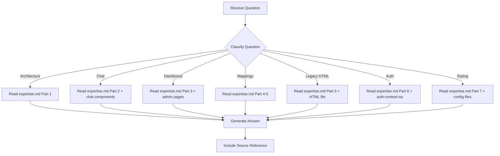

# Frontend Expert - Question Mode

> Read-only command to query frontend knowledge without making any changes.

## Purpose

Answer questions about the EAGLE frontend -- Next.js app, chat interface, admin dashboard, test result mappings, legacy HTML dashboard, auth, styling -- **without making any code changes**.

## Usage

```
/experts:frontend:question [question]
```

## Allowed Tools

`Read`, `Glob`, `Grep`, `Bash` (read-only commands only)

## Question Categories

### Category 1: Architecture Questions

Questions about the Next.js app structure, routes, or component tree.

**Examples**:
- "What pages does the Next.js frontend have?"
- "Where is the top navigation component?"
- "What API routes are available?"

**Resolution**:
1. Read `.claude/commands/experts/frontend/expertise.md` -> Part 1
2. If needed, read specific files in `client/`
3. Provide formatted answer

---

### Category 2: Chat Interface Questions

Questions about chat components, message types, forms, or backend integration.

**Examples**:
- "How does the chat interface handle slash commands?"
- "What happens when the backend is offline?"
- "How do inline forms work in the message list?"

**Resolution**:
1. Read `expertise.md` -> Part 2
2. If needed, read `client/components/chat/chat-interface.tsx`
3. Provide answer with component references

---

### Category 3: Admin Dashboard Questions

Questions about the test results page, viewer page, or data sources.

**Examples**:
- "How does the tests page load trace data?"
- "What use cases does the viewer support?"
- "How does the viewer modal show test traces?"

**Resolution**:
1. Read `expertise.md` -> Part 3
2. If needed, read `client/app/admin/tests/page.tsx` or `client/app/admin/viewer/page.tsx`
3. Provide answer

---

### Category 4: Test Result Mapping Questions

Questions about TEST_NAMES, TEST_DEFS, SKILL_TEST_MAP, or the readiness panel.

**Examples**:
- "Where do I register a new test in the frontend?"
- "What does SKILL_TEST_MAP map?"
- "How does the readiness panel work?"

**Resolution**:
1. Read `expertise.md` -> Part 4 and Part 5
2. Provide specific line references and format examples

---

### Category 5: Legacy Dashboard Questions

Questions about the standalone HTML dashboard.

**Examples**:
- "How does the filter system work?"
- "What are the category tags?"
- "How are trace logs syntax-highlighted?"

**Resolution**:
1. Read `expertise.md` -> Part 5
2. If needed, read `test_results_dashboard.html`
3. Provide answer

---

### Category 6: Auth Questions

Questions about Cognito, dev mode, or the auth guard.

**Examples**:
- "How does dev mode auth work?"
- "What claims are extracted from the JWT?"
- "How is token refresh handled?"

**Resolution**:
1. Read `expertise.md` -> Part 6
2. If needed, read `client/contexts/auth-context.tsx`
3. Provide answer

---

### Category 7: Styling Questions

Questions about Tailwind config, CSS variables, or animations.

**Examples**:
- "What NCI colors are available?"
- "How does the typing indicator work?"
- "What does the streaming cursor look like?"

**Resolution**:
1. Read `expertise.md` -> Part 7
2. If needed, read `client/tailwind.config.ts` or `client/app/globals.css`
3. Provide answer

---

## Workflow



---

## Report Format

```markdown
## Answer

{Direct answer to the question}

## Details

{Supporting information from expertise.md or source files}

## Source

- expertise.md -> {section}
- client/{file}:{line} (if referenced)
- test_results_dashboard.html:{line} (if referenced)
```

---

## Instructions

1. **Read expertise.md first** - All knowledge is stored there
2. **Never modify files** - This is a read-only command
3. **Be specific** - Reference exact file paths and line numbers
4. **Suggest next steps** - If appropriate, suggest what command to run next
