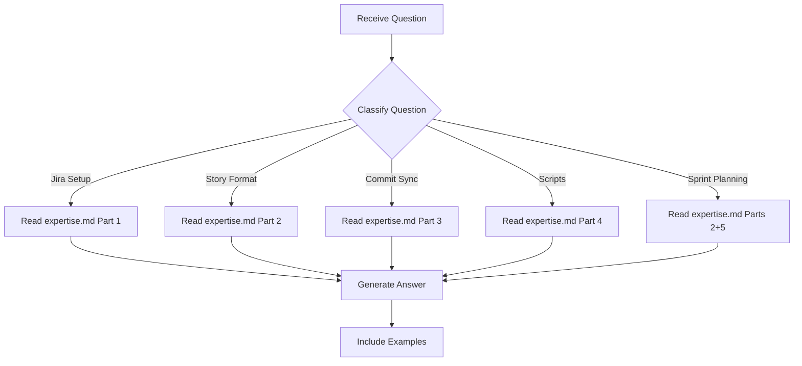

# Jira Expert - Question Mode

> Read-only command to query Jira knowledge without making any changes.

## Purpose

Answer questions about NCI Jira setup, story preparation patterns, commit-to-issue sync, sprint planning, and the scoring rubric — **without making any code or file changes**.

## Usage

```
/experts:jira:question [question]
```

## Allowed Tools

`Read`, `Glob`, `Grep`, `Bash` (read-only commands only)

## Question Categories

### Category 1: Jira Setup Questions

Questions about NCI Jira connection, PAT auth, API endpoints, board configuration.

**Examples**:
- "How do I authenticate to NCI Jira?"
- "What board ID does EAGLE use?"
- "What env vars are needed for Jira sync?"

**Resolution**:
1. Read `.claude/commands/experts/jira/expertise.md` → Part 1
2. Provide formatted answer with config details

---

### Category 2: Story Format Questions

Questions about story structure, required fields, AC templates, consolidation rules.

**Examples**:
- "What fields does a Jira story entry need?"
- "How do I write acceptance criteria for a Done story?"
- "How many stories should I create from 5 related commits?"

**Resolution**:
1. Read `.claude/commands/experts/jira/expertise.md` → Part 2
2. If needed, read example from `docs/jira-new-items-*.md`
3. Provide answer with format template

---

### Category 3: Commit Sync Questions

Questions about the 3-phase matching, scoring rubric, safety constraints.

**Examples**:
- "How does semantic matching work?"
- "What's a scope score of 3 vs 4?"
- "Can jira-sync create new issues?"

**Resolution**:
1. Read `.claude/commands/experts/jira/expertise.md` → Part 3
2. If needed, read `.claude/skills/jira-commit-matcher/SKILL.md`
3. Provide answer with scoring examples

---

### Category 4: Script Questions

Questions about `jira_connect.py`, `jira_commits_sync.py`, `jira_scan_issues.py`, `create_git_stories.py`.

**Examples**:
- "What functions does jira_connect.py export?"
- "How do I run Phase 1 direct matching?"
- "What JSON does jira_scan_issues.py return?"

**Resolution**:
1. Read `.claude/commands/experts/jira/expertise.md` → Part 4
2. If needed, read the actual script file
3. Provide answer with function signatures and usage

---

### Category 5: Sprint Planning Questions

Questions about priority ordering, effort estimation, epic grouping.

**Examples**:
- "How do I prioritize stories for a sprint?"
- "What's the difference between P1 and P2?"
- "How should I estimate effort for a cross-stack feature?"

**Resolution**:
1. Read `.claude/commands/experts/jira/expertise.md` → Parts 2, 5
2. If needed, read recent `docs/jira-new-items-*.md` for examples
3. Provide answer with priority/effort matrix

---

## Workflow



---

## Report Format

```markdown
## Answer

{Direct answer to the question}

## Details

{Supporting information from expertise.md}

## Example

{Relevant format template or script usage}

## Source

- expertise.md → Part {N}
- docs/jira-new-items-*.md (if referenced)
- scripts/{file}.py (if referenced)
```

---

## Instructions

1. **Read expertise.md first** — All knowledge is stored there
2. **Never modify files** — This is a read-only command
3. **Include format examples** — Story format answers are most useful with templates
4. **Be specific** — Reference exact parts, fields, and scoring levels
5. **Reference exemplars** — Point to `docs/jira-new-items-*.md` for real examples
6. **Suggest next steps** — If appropriate, suggest what command to run next
