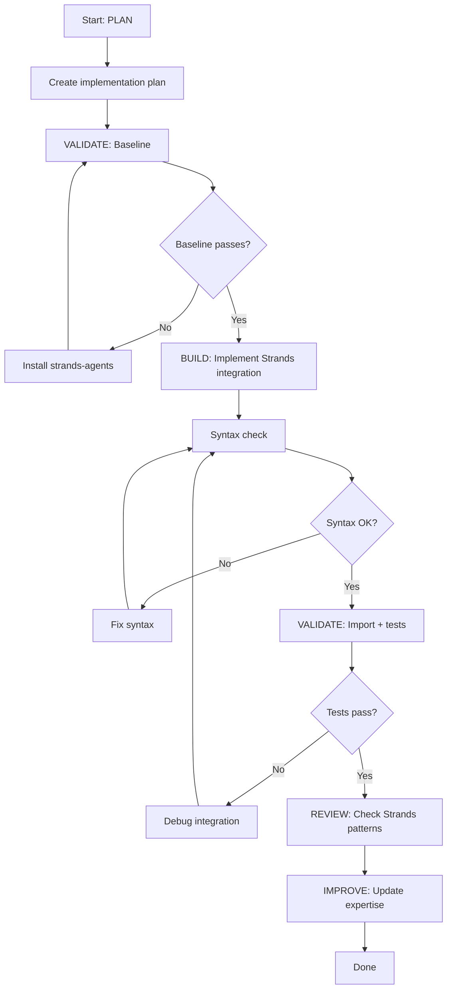

# Strands SDK Expert - Plan Build Improve Workflow

> Full ACT-LEARN-REUSE workflow for Strands SDK development.

## Purpose

Execute the complete Strands development workflow:
1. **PLAN** — Design Strands integration using expertise
2. **VALIDATE (baseline)** — Verify Strands is installable and importable
3. **BUILD** — Implement the integration
4. **VALIDATE (post)** — Verify no regressions
5. **REVIEW** — Check Strands patterns and best practices
6. **IMPROVE** — Update expertise with learnings

## Usage

```
/experts:strands:plan_build_improve [feature description or Strands integration]
```

## Variables

- `TASK`: $ARGUMENTS

## Allowed Tools

`Read`, `Write`, `Edit`, `Bash`, `Grep`, `Glob`

---

## Workflow

### Step 1: PLAN (Context Loading)

1. Read `.claude/commands/experts/strands/expertise.md` for:
   - `Agent()` constructor patterns
   - `BedrockModel` shared model pattern
   - Multi-agent patterns
   - `@tool` decorator and ToolContext
   - Session management
   - Streaming setup
   - EAGLE migration mapping
   - Known issues

2. Analyze the TASK:
   - Search codebase for relevant Strands usage
   - Identify which Strands features are needed
   - Determine Agent configuration

3. Create implementation plan:
   - Write to `.claude/specs/strands-{feature}.md`
   - Include Strands feature checklist
   - Include validation strategy

---

### Step 2: VALIDATE (Baseline)

1. Run pre-change validation:
   ```bash
   # Verify Strands is installed
   pip show strands-agents 2>/dev/null || echo "strands-agents not installed"

   # Verify Strands imports
   python -c "
   from strands import Agent, tool
   from strands.models import BedrockModel
   print('Strands imports OK')
   " 2>&1

   # Verify BedrockModel can be constructed
   python -c "
   from strands.models import BedrockModel
   model = BedrockModel(model_id='us.anthropic.claude-haiku-4-20250514-v1:0', region_name='us-east-1')
   print('BedrockModel construction OK')
   " 2>&1

   # Verify existing files compile
   python -c "import py_compile; py_compile.compile('server/app/sdk_agentic_service.py', doraise=True); print('sdk_agentic_service.py: OK')" 2>&1
   ```

2. If Strands tests exist for the affected area, run them:
   ```bash
   python -m pytest server/tests/test_strands*.py -v 2>&1 || echo "No Strands tests found"
   ```

3. **STOP if baseline fails** — Fix existing issues first

---

### Step 3: BUILD (Implement Changes)

1. Implement Strands integration following proven patterns:
   - Use shared `BedrockModel` at module level (avoid per-request boto3 overhead)
   - Construct `Agent()` per-request with fresh `system_prompt` from DynamoDB
   - Use `@tool` decorator for subagent wrappers
   - Use `callback_handler=None` for server-side agents
   - Use `stream_async()` for SSE streaming

2. Follow multi-tenant patterns:
   - Inject tenant context via `system_prompt`
   - Gate tools per tier
   - Use custom `DynamoDBSessionManager` for session persistence
   - Preserve existing DynamoDB prompt infrastructure

3. Keep changes atomic and focused

---

### Step 4: VALIDATE (Post-Implementation)

1. Run post-change validation:
   ```bash
   # Syntax check new/modified files
   python -c "import py_compile; py_compile.compile('server/app/strands_agentic_service.py', doraise=True)" 2>&1

   # Import check
   python -c "from strands import Agent, tool; from strands.models import BedrockModel; print('OK')"

   # Run affected tests
   python -m pytest server/tests/test_strands*.py -v 2>&1 || echo "No tests to run"
   ```

2. Compare to baseline:
   - All baseline tests still pass?
   - New functionality works?
   - No import errors or type issues?

3. If validation passes: proceed to review
4. If validation fails: fix and re-run

---

### Step 5: REVIEW

1. Review Strands usage:
   - Is `BedrockModel` shared at module level?
   - Is `Agent()` constructed per-request with fresh prompts?
   - Are `@tool` functions properly decorated with docstrings?
   - Is `callback_handler=None` for headless agents?
   - Is streaming set up via `stream_async()`?

2. Check for:
   - `system_prompt` includes tenant context
   - Shared model avoids per-request boto3 overhead
   - No module-level `Agent()` with frozen prompts
   - Concurrent access uses per-request construction (not shared agents)
   - DynamoDB prompt resolution is preserved
   - Tool docstrings are complete (required for schema extraction)

---

### Step 6: IMPROVE (Self-Improve)

1. Determine outcome:
   - **success**: All validations pass
   - **partial**: Some checks pass
   - **failed**: Validation fails

2. Update `.claude/commands/experts/strands/expertise.md`:
   - Add to `patterns_that_work`
   - Add to `patterns_to_avoid`
   - Document any `common_issues`
   - Add helpful `tips`

3. Update `last_updated` timestamp

---

## Decision Points



---

## Report Format

```markdown
## Strands Integration Complete: {TASK}

### Summary

| Phase | Status | Notes |
|-------|--------|-------|
| Plan | DONE | .claude/specs/strands-{feature}.md |
| Baseline | PASS | Strands importable, BedrockModel OK |
| Build | DONE | {description of integration} |
| Validation | PASS | No regressions |
| Review | PASS | Follows Strands patterns |
| Improve | DONE | Expertise updated |

### Strands Features Used

- [ ] Agent() constructor
- [ ] BedrockModel (shared)
- [ ] @tool decorator
- [ ] Agents-as-tools (multi-agent)
- [ ] Swarm (autonomous handoff)
- [ ] Graph (deterministic DAG)
- [ ] SessionManager
- [ ] stream_async() / CallbackHandler
- [ ] AgentSkills integration

### Learnings Captured

- Pattern: {what worked}
- Tip: {useful observation}
```

---

## Instructions

1. **Follow the workflow order** — Don't skip validation steps
2. **Stop on failures** — Fix before proceeding
3. **Keep atomic** — One Strands integration per workflow
4. **Always improve** — Even failed attempts have learnings
5. **Share BedrockModel** — Always module-level, never per-request
6. **Per-request Agent** — Always fresh construction with DynamoDB prompts
7. **Compare to Claude SDK** — Note performance/behavior differences
