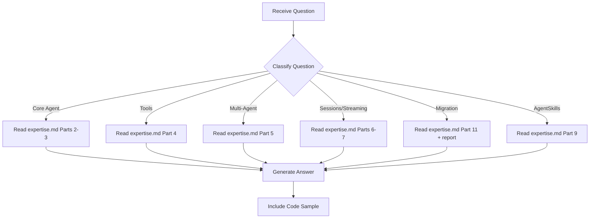

# Strands SDK Expert - Question Mode

> Read-only command to query Strands SDK knowledge without making any changes.

## Purpose

Answer questions about the Strands Agents SDK — `Agent()`, `@tool`, multi-agent patterns (swarm, graph, agents-as-tools), BedrockModel, streaming, sessions, hooks, AgentSkills — **without making any code changes**.

## Usage

```
/experts:strands:question [question]
```

## Allowed Tools

`Read`, `Glob`, `Grep`, `Bash` (read-only commands only)

## Question Categories

### Category 1: Core Agent Questions

Questions about `Agent()`, construction, invocation, system_prompt.

**Examples**:
- "How do I create a Strands Agent with Bedrock?"
- "Can I change the system_prompt between invocations?"
- "What's the difference between sync and async invocation?"

**Resolution**:
1. Read `.claude/commands/experts/strands/expertise.md` → Parts 2-3
2. If needed, read comparison report at `docs/development/20260302-*-report-claude-sdk-vs-strands-v1.md`
3. Provide formatted answer with code sample

---

### Category 2: Tool Questions

Questions about `@tool` decorator, `ToolContext`, tool registration, hot-reload.

**Examples**:
- "How do I create a custom tool in Strands?"
- "How does ToolContext.invocation_state work?"
- "Can tools hot-reload in Strands?"

**Resolution**:
1. Read `.claude/commands/experts/strands/expertise.md` → Part 4
2. Provide answer with `@tool` decorator examples

---

### Category 3: Multi-Agent Questions

Questions about agents-as-tools, swarm, graph, workflow patterns.

**Examples**:
- "What multi-agent patterns does Strands support?"
- "How does swarm handoff work?"
- "What's the equivalent of Claude SDK's Task tool in Strands?"
- "When should I use Graph vs Swarm?"

**Resolution**:
1. Read `.claude/commands/experts/strands/expertise.md` → Part 5
2. If needed, read Section 8 of the comparison report
3. Provide answer with pattern comparison and code samples

---

### Category 4: Session & Streaming Questions

Questions about `SessionManager`, persistence, streaming, callback handlers.

**Examples**:
- "How do I persist sessions in Strands?"
- "How do I stream Strands responses as SSE?"
- "What SessionManager should I use for EAGLE?"

**Resolution**:
1. Read `.claude/commands/experts/strands/expertise.md` → Parts 6-7
2. Provide answer with session manager setup

---

### Category 5: Migration Questions

Questions about Claude Agent SDK → Strands migration, architecture comparison.

**Examples**:
- "How do I migrate EAGLE's build_skill_agents() to Strands?"
- "What's the Strands equivalent of AgentDefinition?"
- "Will EAGLE's hot-reload still work on Strands?"
- "What's the overhead difference between the two SDKs?"

**Resolution**:
1. Read `.claude/commands/experts/strands/expertise.md` → Part 11
2. Read comparison report for detailed architecture analysis
3. Provide migration mapping with before/after code samples

---

### Category 6: AgentSkills Questions

Questions about SKILL.md format, progressive disclosure, skill integration.

**Examples**:
- "Is EAGLE's SKILL.md compatible with AgentSkills.io?"
- "How does progressive skill disclosure work?"
- "What are the three skill integration patterns?"

**Resolution**:
1. Read `.claude/commands/experts/strands/expertise.md` → Part 9
2. If needed, read Section 9 of the comparison report
3. Provide answer with compatibility assessment

---

## Workflow



---

## Report Format

```markdown
## Answer

{Direct answer to the question}

## Details

{Supporting information from expertise.md or comparison report}

## Code Sample

{Copy-pasteable code from expertise or comparison report}

## Source

- expertise.md → {section}
- docs/development/20260302-*-report-*.md → Section {N} (if referenced)
```

---

## Instructions

1. **Read expertise.md first** — All knowledge is stored there
2. **Never modify files** — This is a read-only command
3. **Include code samples** — SDK answers are most useful with working code
4. **Be specific** — Reference exact parts, sections, and line numbers
5. **Compare to Claude SDK** — When relevant, show both patterns side-by-side
6. **Suggest next steps** — If appropriate, suggest what command to run next
