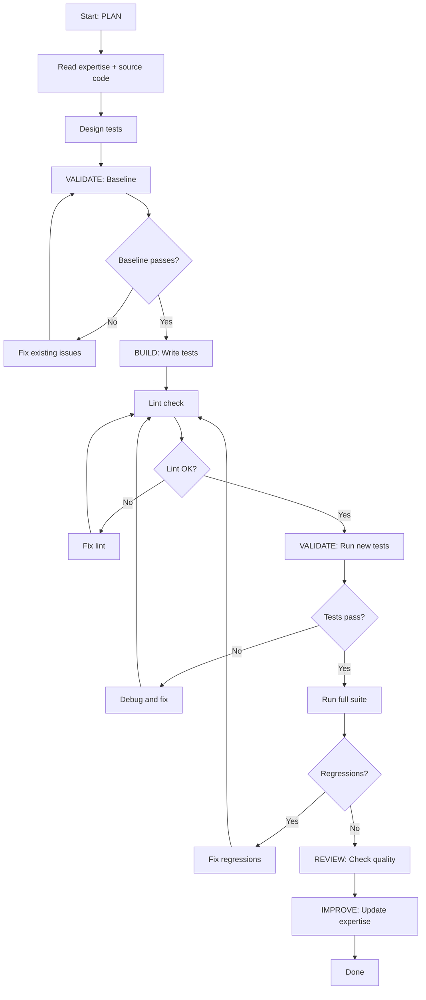

# Test Expert - Plan Build Improve Workflow

> Full ACT-LEARN-REUSE workflow for test suite development.

## Purpose

Execute the complete test development workflow:
1. **PLAN** - Design new test(s) using expertise
2. **VALIDATE (baseline)** - Run existing suite, capture baseline
3. **BUILD** - Implement the test(s)
4. **VALIDATE (post)** - Run suite, verify no regressions
5. **REVIEW** - Check test quality
6. **IMPROVE** - Update expertise with learnings

## Usage

```
/experts:test:plan_build_improve [test description or feature]
```

## Variables

- `TASK`: $ARGUMENTS

## Allowed Tools

`Read`, `Write`, `Edit`, `Glob`, `Grep`, `Bash`

---

## Workflow

### Step 1: PLAN (Context Loading)

1. Read `expertise.md` for:
   - Test inventory and patterns
   - Coverage gaps
   - Known issues

2. Analyze the TASK:
   - Search codebase for source code to test
   - Identify which pattern(s) to use
   - Determine mock requirements

3. Create test plan:
   - List all tests to write
   - Specify target file, class, method names
   - Specify mocks, assertions, cleanup

---

### Step 2: VALIDATE (Baseline)

1. Run pre-change validation:
   ```bash
   # Lint
   cd server && ruff check app/

   # Run existing unit tests (fast)
   python -m pytest tests/test_perf_simple_message.py tests/test_chat_endpoints.py -v
   ```

2. Save baseline pass/fail counts

3. **STOP if baseline fails** — Fix existing issues first

---

### Step 3: BUILD (Implement Tests)

1. Implement test functions following expertise.md Part 2 patterns

2. Key conventions:
   - Import from `app.*` inside test methods
   - Mock all external dependencies for unit tests
   - Include cleanup (cache clears)
   - Use descriptive test names

3. If creating a new file:
   - Add docstring explaining scope
   - Add helper constants (TENANT, USER, WORKSPACE_ID, TIER)
   - Group related tests in classes

---

### Step 4: VALIDATE (Post-Implementation)

1. Run post-change validation:
   ```bash
   # Lint the new test file
   cd server && ruff check tests/{file}.py

   # Run new tests
   python -m pytest tests/{file}.py -v

   # Run existing tests for regressions
   python -m pytest tests/test_perf_simple_message.py tests/test_chat_endpoints.py -v
   ```

2. Compare to baseline:
   - All baseline tests still pass?
   - New tests pass?
   - No import errors or side effects?

3. If validation fails: fix and re-run

---

### Step 5: REVIEW

1. Review new tests for:
   - Correct mock levels (not too broad, not too narrow)
   - Meaningful assertions (not just `assert True`)
   - Cleanup of shared state (caches, globals)
   - Independence (no test depends on another)
   - Speed (unit tests < 1s each)

2. Check for:
   - Proper use of `@pytest.mark.asyncio` for async tests
   - `_cache.clear()` at end of cache tests
   - Accounting for `_compliance_matrix_tool` in tool counts
   - No hardcoded AWS resource names

---

### Step 6: IMPROVE (Self-Improve)

1. Determine outcome: `success` / `partial` / `failed`

2. Update `expertise.md`:
   - Part 1: Add new tests to inventory
   - Part 3: Mark resolved coverage gaps
   - Part 5: Add to learnings sections

3. Update `last_updated` timestamp

---

## Decision Points



---

## Report Format

```markdown
## Test Development Complete: {TASK}

### Summary

| Phase | Status | Notes |
|-------|--------|-------|
| Plan | DONE | {N} tests designed |
| Baseline | PASS | {N} existing tests green |
| Build | DONE | {N} tests implemented |
| Validation | PASS | No regressions |
| Review | PASS | Follows patterns |
| Improve | DONE | Expertise updated |

### New Tests

| File | Class | Test | Status |
|------|-------|------|--------|
| {file} | {class} | {test_name} | PASS |

### Coverage Gaps Resolved

- {gap 1} -> now tested
- {gap 2} -> now tested

### Learnings Captured

- Pattern: {what worked}
- Tip: {useful observation}
```

---

## Instructions

1. **Follow the workflow order** - Don't skip validation steps
2. **Stop on failures** - Fix before proceeding
3. **Keep atomic** - One feature area per workflow
4. **Always improve** - Even failed attempts have learnings
5. **Run lint before tests** - Catches syntax errors early
6. **Test cleanup** - Run twice to confirm no state leaks
