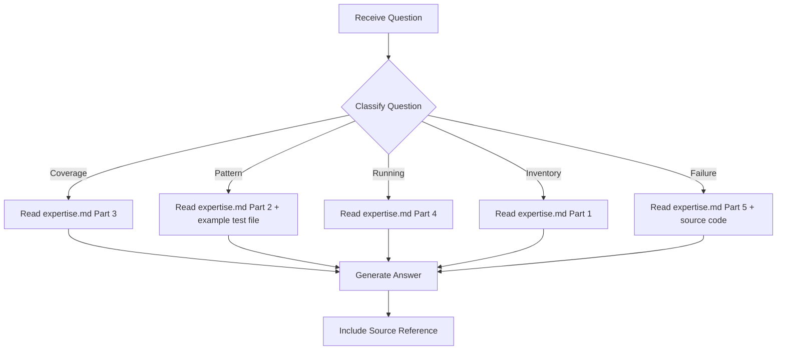

# Test Expert - Question Mode

> Read-only command to query test suite knowledge without making any changes.

## Purpose

Answer questions about the EAGLE test suite — pytest tests, Playwright E2E tests, coverage gaps, test patterns, running tests — **without making any code changes**.

## Usage

```
/experts:test:question [question]
```

## Allowed Tools

`Read`, `Glob`, `Grep`, `Bash` (read-only commands only)

## Question Categories

### Category 1: Coverage Questions

Questions about what is and isn't tested.

**Examples**:
- "What tests cover the fast-path?"
- "Is the workspace cache invalidation tested?"
- "What coverage gaps exist for fire-and-forget writes?"

**Resolution**:
1. Read `expertise.md` -> Part 3 (Coverage Gaps)
2. Search `server/tests/` for relevant test classes/methods
3. Report coverage status and gaps

---

### Category 2: Test Pattern Questions

Questions about how to write tests.

**Examples**:
- "How do I mock DynamoDB in tests?"
- "What's the pattern for cache behavior tests?"
- "How do I test async functions?"

**Resolution**:
1. Read `expertise.md` -> Part 2 (Test Patterns)
2. Find example in existing test files
3. Provide pattern with code snippet

---

### Category 3: Running Tests Questions

Questions about test execution.

**Examples**:
- "How do I run just the performance tests?"
- "Which tests need AWS credentials?"
- "How do I run a single Playwright spec?"

**Resolution**:
1. Read `expertise.md` -> Part 4 (Running Tests)
2. Provide exact command

---

### Category 4: Test Inventory Questions

Questions about what tests exist.

**Examples**:
- "How many backend tests are there?"
- "What does test_cache_hit_skips_dynamodb validate?"
- "List all Playwright specs"

**Resolution**:
1. Read `expertise.md` -> Part 1 (Test Inventory)
2. If needed, read specific test file for details
3. Provide structured answer

---

### Category 5: Failure Diagnosis Questions

Questions about why tests fail.

**Examples**:
- "Why does test_cache_bypassed_when_skill_names_filter fail?"
- "What causes E402 lint errors?"
- "Why does the perf-test endpoint return 404?"

**Resolution**:
1. Read `expertise.md` -> Part 5 (Learnings: common_issues)
2. If needed, read test file and source code
3. Provide diagnosis and fix

---

## Workflow



---

## Report Format

```markdown
## Answer

{Direct answer to the question}

## Details

{Supporting information from expertise.md or source files}

## Source

- expertise.md -> {section}
- server/tests/{file}:{line} (if referenced)
```

---

## Instructions

1. **Read expertise.md first** - All knowledge is stored there
2. **Never modify files** - This is a read-only command
3. **Be specific** - Reference exact test names and line numbers
4. **Suggest next steps** - If appropriate, suggest `/experts:test:plan` or `/experts:test:add-test`
