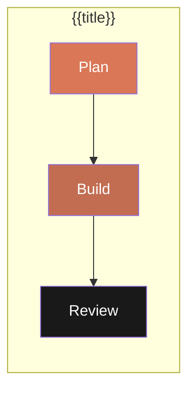

![[adw-banner.png|banner]]

# {{title}}

## Overview
Brief description of this AI Developer Workflow.

## Pattern
> **Type**: `plan_build_review`
> **Steps**: 3 (Plan -> Build -> Review)

## Workflow Diagram


## Agents
| Agent | Role | Step | Status |
|-------|------|------|--------|
| [[plan-agent]] | Creates implementation plan | 1 | Active |
| [[build-agent]] | Implements the plan | 2 | Active |
| [[review-agent]] | Reviews code quality | 3 | Active |

## Input Schema
```json
{
  "prompt": "Feature description",
  "working_dir": "/path/to/project",
  "model": "claude-opus-4-5-20251101"
}
```

## Output Schema
```json
{
  "plan_path": "specs/feature-name.md",
  "build_status": "complete",
  "review_verdict": "PASS"
}
```

## Triggers
- Manual: `start adw: {{title}}: <prompt>`
- API: `POST /adws/start`

## Related
- Skills: [[skill-name]]
- MCP Servers: [[mcp-name]]
- Documentation: [[link]]

## Source Files
- Workflow: `adws/adw_workflows/adw_{{title}}.py`

## Changelog
- <% tp.date.now("YYYY-MM-DD") %>: Created
