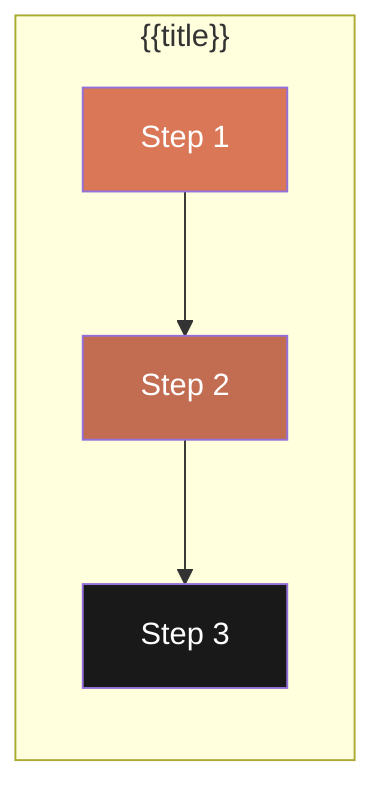

![[agentic-prompt-banner.png|banner]]

# {{title}}

## Overview
Brief description of this Agentic Prompt workflow.

> **Note**: This is an **Agentic Prompt**, not an ADW. It orchestrates multiple commands/agents through pure markdown without backend infrastructure.

## Agentic Prompt vs ADW
| Aspect | This Agentic Prompt | ADW |
|--------|---------------------|-----|
| Infrastructure | None - pure markdown | Backend systems, logging |
| Execution | Claude follows steps | Python/TS runtime |
| State | Stateless | Persistent state |

## Workflow Diagram


## Usage
```bash
/{{title}} <required-arg> [optional-arg]
```

## Variables
| Variable | Source | Description |
|----------|--------|-------------|
| `$1` | Argument | First argument |
| `VAR_NAME` | CLAUDE.md | Configuration variable |

## Workflow Steps

### Step 0: Setup
Initial setup and validation.

### Step 1: First Agent/Command
Invoke: `Use the X-agent to...` or `/command-name`
- **Input**: Description
- **Output**: Description

### Step 2: Second Agent/Command
Invoke: `Use the Y-agent to...` or `/command-name`
- **Input**: Description
- **Output**: Description

### Step 3: Final Step
Invoke: `Use the Z-agent to...` or `/command-name`
- **Input**: Description
- **Output**: Description

## Agents Used
| Agent | Role | Step |
|-------|------|------|
| [[agent-name]] | Description | 1 |

## Commands Used
| Command | Purpose | Step |
|---------|---------|------|
| [[/command-name]] | Description | 2 |

## Hooks
| Hook | Type | Step |
|------|------|------|
| [[hook-name]] | Stop Validator | Final |

## Report Format
```
## {{title}} Report

### Setup
- Variable: value

### Progress
- [x] Step 1: Complete
- [x] Step 2: Complete
- [x] Step 3: Complete

### Deliverables
1. Output file 1
2. Output file 2
```

## Source Files
- Main Command: `.claude/commands/{{title}}.md`
- Sub-commands: `.claude/commands/{{folder}}/`

## Related
- Skills: [[skill-name]]
- ADWs: [[adw-name]] (if part of larger workflow)

## Changelog
- <% tp.date.now("YYYY-MM-DD") %>: Created


