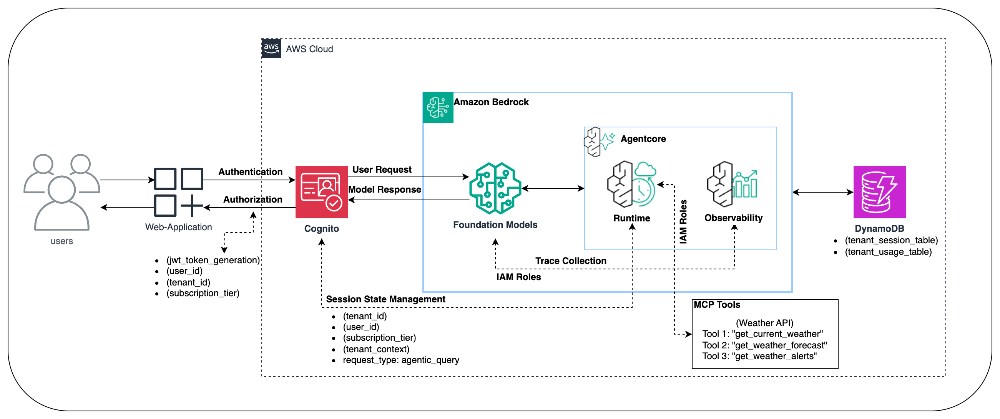

# EAGLE — Multi-Tenant AI Agent Platform

A multi-tenant AI platform built on **Claude SDK**, **Amazon Bedrock**, **Cognito JWT authentication**, **DynamoDB single-table design**, and **ECS Fargate**. Built for the NCI Office of Acquisitions as a reference implementation for multi-tenant AI applications on AWS.

## Quick Start

### Prerequisites

- **Python 3.11+**, **Node.js 20+**, **Docker**, **AWS CLI** configured
- **[just](https://github.com/casey/just)** task runner (`cargo install just` or `brew install just`)
- AWS account with Bedrock model access enabled (Claude Haiku/Sonnet)

### Local Development

```bash
# Option A: Docker Compose (recommended)
just dev

# Option B: Run services individually
just dev-backend    # FastAPI at http://localhost:8000
just dev-frontend   # Next.js at http://localhost:3000
```

### Common Commands

```bash
just --list         # See all available commands

# Development
just lint           # Ruff (Python) + tsc (TypeScript)
just test           # Backend pytest
just test-e2e       # Playwright E2E against Fargate

# Eval Suite
just eval           # Full 28-test eval suite (haiku)
just eval-quick 1,2 # Run specific tests
just eval-aws       # AWS tool tests only (16-20)

# Deploy
just deploy         # Full: build → ECR push → ECS update → wait
just deploy-backend # Backend only
just deploy-frontend # Frontend only

# Infrastructure
just cdk-synth      # Compile CDK stacks
just cdk-diff       # Preview changes
just cdk-deploy     # Deploy all stacks

# Operations
just status         # ECS health + live URLs
just urls           # Print frontend/backend URLs
just check-aws      # Verify AWS connectivity
just logs           # Tail backend ECS logs
just logs frontend  # Tail frontend ECS logs

# Composite
just ci             # lint → test → eval-aws
just ship           # lint → deploy
```

## Architecture



> **Interactive diagrams** in [`docs/excalidraw-diagrams/aws/`](docs/excalidraw-diagrams/aws/) — open in [Excalidraw](https://excalidraw.com) or Obsidian:
> - [`eagle-aws-architecture.excalidraw.md`](docs/excalidraw-diagrams/aws/eagle-aws-architecture.excalidraw.md) (dark)
> - [`eagle-aws-architecture-light.excalidraw.md`](docs/excalidraw-diagrams/aws/eagle-aws-architecture-light.excalidraw.md) (light)

### Request Flow

```
User → Cognito JWT → ALB (public) → Next.js Frontend (ECS Fargate)
                                         ↓
                                    ALB (internal) → FastAPI Backend (ECS Fargate)
                                         ↓
                              Claude SDK → Supervisor Agent → Specialist Subagents
                                         ↓
                              DynamoDB / S3 / CloudWatch / Bedrock
```

### EAGLE Plugin

The **EAGLE plugin** (`eagle-plugin/`) is the single source of truth for all agent and skill definitions. Agents use YAML frontmatter in markdown files, auto-discovered by `server/eagle_skill_constants.py` at runtime.

| Type | Count | Names |
|------|-------|-------|
| **Supervisor** | 1 | Orchestrator — routes to specialists |
| **Specialist Agents** | 7 | legal-counsel, market-intelligence, tech-translator, public-interest, policy-supervisor, policy-librarian, policy-analyst |
| **Skills** | 5 | oa-intake, document-generator, compliance, knowledge-retrieval, tech-review |

### AWS Infrastructure (4 CDK Stacks)

All stacks in `infrastructure/cdk-eagle/`:

| Stack | Resources |
|-------|-----------|
| **EagleCiCdStack** | GitHub OIDC provider, deploy role |
| **EagleCoreStack** | VPC (2 AZ, 1 NAT), Cognito User Pool, DynamoDB table, IAM app role, S3 import |
| **EagleComputeStack** | ECR repos, ECS Fargate cluster, backend ALB (internal), frontend ALB (public), auto-scaling |
| **EagleEvalStack** | S3 eval artifacts, CloudWatch dashboard + alarm, SNS alerts |

### Environment Tiers

| Setting | Dev | Staging | Prod |
|---------|-----|---------|------|
| Backend CPU/Memory | 512 / 1024 MiB | 512 / 1024 MiB | 1024 / 2048 MiB |
| Frontend CPU/Memory | 256 / 512 MiB | 256 / 512 MiB | 512 / 1024 MiB |
| Desired / Max Tasks | 1 / 4 | 2 / 6 | 2 / 10 |
| AZs / NAT Gateways | 2 / 1 | 2 / 2 | 3 / 3 |

## Project Structure

```
.
├── client/                  # Next.js 14+ frontend (App Router, Tailwind, standalone output)
├── server/                  # FastAPI backend (Python 3.11+, Claude SDK)
│   ├── app/
│   │   ├── main.py          # FastAPI routes + middleware
│   │   ├── sdk_agentic_service.py  # Claude SDK agent orchestration
│   │   ├── session_store.py # Unified DynamoDB access (eagle table)
│   │   ├── cognito_auth.py  # JWT → tenant context
│   │   ├── streaming_routes.py  # SSE streaming
│   │   ├── cost_attribution.py  # Per-tenant cost tracking
│   │   └── document_export.py   # PDF/Word export
│   ├── tests/
│   │   ├── test_eagle_sdk_eval.py   # Eval suite (28 tests)
│   │   └── eval_aws_publisher.py    # CloudWatch/S3 publish
│   └── eagle_skill_constants.py     # Auto-discovery from plugin
├── eagle-plugin/            # Agent/skill source of truth
│   ├── plugin.json          # Manifest
│   ├── agents/              # 8 agents (supervisor + 7 specialists)
│   ├── skills/              # 5 skills with YAML frontmatter
│   └── diagrams/            # Use case flow diagrams
├── infrastructure/
│   └── cdk-eagle/           # CDK stacks (TypeScript)
│       ├── lib/             # core, compute, cicd, eval stacks
│       ├── config/environments.ts
│       └── bin/eagle.ts
├── deployment/
│   ├── docker/              # Dockerfile.backend + Dockerfile.frontend
│   └── docker-compose.dev.yml
├── scripts/                 # Deployment + setup scripts
├── docs/                    # Architecture docs + guides
├── .github/workflows/       # CI/CD (deploy.yml)
├── Justfile                 # Unified task runner
└── .claude/                 # Expert system, specs, commands
```

## Deployment Guide

### Requirements for a New AWS Account

**AWS Credentials**: Configure the AWS CLI with an IAM user or role that has admin access (or at minimum: CloudFormation, VPC, ECS, ECR, Cognito, DynamoDB, S3, IAM, Bedrock, CloudWatch, ELB):

```bash
aws configure
# AWS Access Key ID:     <your-key>
# AWS Secret Access Key: <your-secret>
# Default region name:   us-east-1
# Default output format: json

# Verify credentials
aws sts get-caller-identity
```

**Account-specific config**: If you forked this repo, update the GitHub owner/repo in `infrastructure/cdk-eagle/config/environments.ts`:

```typescript
// Change these to match YOUR GitHub account and repo name
githubOwner: 'your-github-username',
githubRepo: 'your-repo-name',
```

### First-Time Setup

> **One-command setup**: If you have AWS credentials configured and Bedrock model access enabled, you can run the entire setup with a single command:
>
> ```bash
> just setup
> ```
>
> This installs CDK dependencies, creates the S3 bucket, bootstraps CDK, deploys all stacks, builds and deploys containers, creates test users, and verifies connectivity. The steps below explain each stage if you prefer to run them individually.

#### 0. Enable Bedrock Model Access (manual, one-time)

This cannot be automated and must be done in the AWS Console:

1. Go to **AWS Console → Amazon Bedrock → Model Access**
2. Click **Request Access** and select **Anthropic Claude 3 Haiku** and **Anthropic Claude 3.5 Sonnet**
3. Wait for "Access granted" status before proceeding

#### 1. Create Pre-requisite Resources

The S3 bucket is **imported** (not created) by CDK and must exist first. The DynamoDB table is **created** by CDK — do not create it manually.

```bash
# S3 bucket for documents (must exist before CDK deploy)
aws s3 mb s3://nci-documents --region us-east-1
```

#### 2. Bootstrap and Deploy CDK

```bash
cd infrastructure/cdk-eagle
npm ci

# Bootstrap CDK (once per account/region)
ACCOUNT_ID=$(aws sts get-caller-identity --query Account --output text)
npx cdk bootstrap aws://$ACCOUNT_ID/us-east-1

# Deploy all 4 stacks (creates VPC, Cognito, DynamoDB, ECS, ECR, etc.)
npx cdk deploy --all --require-approval never --outputs-file outputs.json
```

#### 3. Build and Deploy Containers

```bash
# Using the Justfile (recommended):
just deploy

# Or manually:
just build-backend     # Builds backend image
just build-frontend    # Builds frontend image (auto-fetches Cognito config)
just deploy-backend    # Push + ECS update
just deploy-frontend   # Push + ECS update
```

#### 4. Create Cognito Users

Users require `custom:tenant_id` and `custom:subscription_tier` custom attributes for the multi-tenant auth system. Admin users also need a Cognito group (`{tenant}-admins`).

```bash
# Automated: creates test user + admin user with all required attributes
just create-users
```

This creates the following accounts:

| User | Email | Password | Tenant | Tier | Role |
|------|-------|----------|--------|------|------|
| Test User | testuser@example.com | EagleTest2024! | nci | basic | user |
| Admin User | admin@example.com | EagleAdmin2024! | nci | premium | admin |

<details>
<summary>Manual user creation (click to expand)</summary>

```bash
USER_POOL_ID=$(aws cloudformation describe-stacks --stack-name EagleCoreStack \
  --query "Stacks[0].Outputs[?OutputKey=='UserPoolId'].OutputValue" --output text)

# Create test user (basic tier)
aws cognito-idp admin-create-user \
  --user-pool-id $USER_POOL_ID \
  --username testuser@example.com \
  --user-attributes \
    Name=email,Value=testuser@example.com \
    Name=email_verified,Value=true \
    Name=given_name,Value=Test \
    Name=family_name,Value=User \
    Name=custom:tenant_id,Value=nci \
    Name=custom:subscription_tier,Value=basic \
  --temporary-password 'TempPass123!' \
  --message-action SUPPRESS

aws cognito-idp admin-set-user-password \
  --user-pool-id $USER_POOL_ID \
  --username testuser@example.com \
  --password 'EagleTest2024!' \
  --permanent

# Create admin user (premium tier)
aws cognito-idp admin-create-user \
  --user-pool-id $USER_POOL_ID \
  --username admin@example.com \
  --user-attributes \
    Name=email,Value=admin@example.com \
    Name=email_verified,Value=true \
    Name=given_name,Value=Admin \
    Name=family_name,Value=User \
    Name=custom:tenant_id,Value=nci \
    Name=custom:subscription_tier,Value=premium \
  --temporary-password 'TempPass123!' \
  --message-action SUPPRESS

aws cognito-idp admin-set-user-password \
  --user-pool-id $USER_POOL_ID \
  --username admin@example.com \
  --password 'EagleAdmin2024!' \
  --permanent

# Create admin group and add admin user
aws cognito-idp create-group \
  --user-pool-id $USER_POOL_ID \
  --group-name nci-admins \
  --description "NCI tenant administrators"

aws cognito-idp admin-add-user-to-group \
  --user-pool-id $USER_POOL_ID \
  --username admin@example.com \
  --group-name nci-admins
```

</details>

#### 5. Set GitHub Secret (for CI/CD)

Get the deploy role ARN from CDK outputs and add it as a GitHub repository secret:

```bash
# Print the deploy role ARN
aws cloudformation describe-stacks --stack-name EagleCiCdStack \
  --query "Stacks[0].Outputs[?OutputKey=='DeployRoleArn'].OutputValue" --output text
```

Add this value as `DEPLOY_ROLE_ARN` in **GitHub → Settings → Secrets and variables → Actions → New repository secret**. After this, pushes to `main` trigger automatic deployment.

#### 6. Verify

```bash
just status     # Shows ECS health + live URLs
just check-aws  # Verifies all AWS service connectivity
just urls       # Print frontend + backend URLs
```

### CI/CD Pipeline

The GitHub Actions workflow (`.github/workflows/deploy.yml`) runs on push to `main`:

1. **deploy-infra** — OIDC auth → `cdk deploy --all` → extract outputs
2. **deploy-backend** — Docker build+push → ECS rolling update → wait for stable
3. **deploy-frontend** — Docker build+push (with Cognito build-args) → ECS rolling update
4. **verify** — Health checks on `/api/health` and `/`

Authentication uses GitHub OIDC federation — no static IAM keys.

## Data Model

### DynamoDB Single-Table Design (`eagle`)

| Entity | PK Pattern | SK Pattern |
|--------|-----------|------------|
| Session | `SESSION#{tenant}#{user}` | `SESSION#{session_id}` |
| Message | `SESSION#{tenant}#{user}` | `MSG#{session_id}#{timestamp}` |
| Usage | `USAGE#{tenant}` | `USAGE#{date}#{session}#{timestamp}` |
| Cost | `COST#{tenant}` | `COST#{date}#{timestamp}` |
| Subscription | `SUB#{tenant}` | `SUB#{tier}#current` |

### Authentication

JWT tokens from Cognito carry tenant context:

```json
{
  "sub": "user-uuid",
  "email": "user@company.com",
  "custom:tenant_id": "acme-corp",
  "custom:subscription_tier": "premium"
}
```

Session IDs encode tenant context: `{tenant_id}-{tier}-{user_id}-{session_id}`

### Subscription Tiers

| Feature | Basic | Advanced | Premium |
|---------|-------|----------|---------|
| Daily Messages | 50 | 200 | 1,000 |
| Monthly Messages | 1,000 | 5,000 | 25,000 |
| Concurrent Sessions | 1 | 3 | 10 |
| Session Duration | 30 min | 60 min | 240 min |

## API Reference

### Core

| Method | Endpoint | Description |
|--------|----------|-------------|
| POST | `/api/chat` | Chat with agent (REST) |
| POST | `/api/chat/stream` | Chat with agent (SSE streaming) |
| GET | `/api/health` | Health check |
| GET | `/api/tools` | List available tools |

### Sessions

| Method | Endpoint | Description |
|--------|----------|-------------|
| GET | `/api/sessions` | List sessions |
| POST | `/api/sessions` | Create session |
| GET | `/api/sessions/{id}` | Get session |
| DELETE | `/api/sessions/{id}` | Delete session |
| GET | `/api/sessions/{id}/messages` | Get messages |

### Documents

| Method | Endpoint | Description |
|--------|----------|-------------|
| GET | `/api/documents` | List documents |
| GET | `/api/documents/{key}` | Get document |
| POST | `/api/documents/export` | Export to PDF/Word |

### User

| Method | Endpoint | Description |
|--------|----------|-------------|
| GET | `/api/user/me` | Current user profile |
| GET | `/api/user/usage` | Usage metrics |

### Admin

| Method | Endpoint | Description |
|--------|----------|-------------|
| GET | `/api/admin/dashboard` | Dashboard data |
| GET | `/api/admin/users` | List users |
| GET | `/api/admin/cost-report` | Cost report |
| GET | `/api/admin/tenants/{id}/comprehensive-report` | Full tenant report |
| POST | `/api/admin/add-to-group` | Add user to Cognito group |

### Telemetry

| Method | Endpoint | Description |
|--------|----------|-------------|
| GET | `/api/telemetry` | Telemetry data |

## Demo


## Cleanup

```bash
# Remove all CDK stacks
cd infrastructure/cdk-eagle
npx cdk destroy --all

# ECR repos have RETAIN policy — delete manually if needed
aws ecr delete-repository --repository-name eagle-backend-dev --force
aws ecr delete-repository --repository-name eagle-frontend-dev --force
```

## Disclaimers

**This is a code sample for demonstration purposes.** Production use requires security review, rate limiting, encryption, compliance review, load testing, and monitoring.

**Responsible AI**: This system includes automated AWS operations. Users must ensure appropriate safeguards and human oversight. See [AWS Responsible AI](https://docs.aws.amazon.com/wellarchitected/latest/generative-ai-lens/responsible-ai.html).

**Guardrails**: Production deployments should implement [Amazon Bedrock Guardrails](https://docs.aws.amazon.com/bedrock/latest/userguide/guardrails.html) for content filtering, PII redaction, and safety thresholds.

## Cost Notes

| Service | Billing |
|---------|---------|
| Bedrock | Per-token ([pricing](https://aws.amazon.com/bedrock/pricing/)) |
| DynamoDB | On-demand (pay per request) |
| ECS Fargate | Per vCPU + memory per second |
| Cognito | Free for first 50K MAU |
| S3 | Standard storage + requests |
