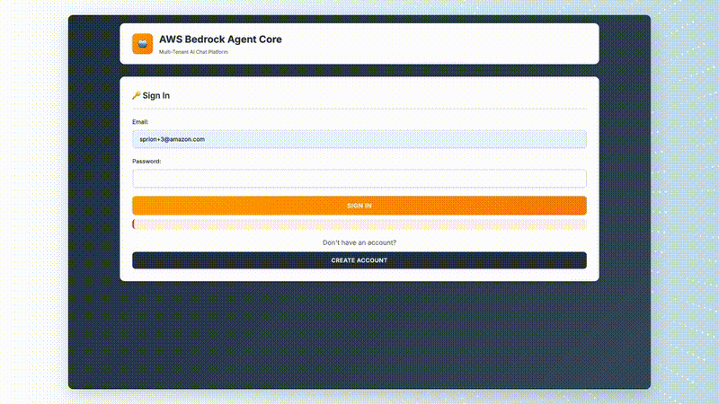

# EAGLE — Multi-Tenant AI Acquisition Assistant

A multi-tenant AI platform built for the **NCI Office of Acquisitions**, using the **Anthropic Python SDK** (routed through **Amazon Bedrock** for model inference), **Cognito JWT authentication**, **DynamoDB session storage**, and **granular cost attribution**. This application serves as a reference implementation for multi-tenant AI applications on AWS.

## Core Concept

EAGLE (Enhanced Acquisition Guidance & Lifecycle Engine) uses a **supervisor + subagent architecture** to guide contracting officers through the federal acquisition lifecycle. The backend has two orchestration modes:

1. **Claude Agent SDK** (`sdk_agentic_service.py`): Supervisor delegates to skill subagents via the `Task` tool, each with a fresh context window — **active** in `main.py` and `streaming_routes.py`
2. **Anthropic SDK** (`agentic_service.py`): Single system prompt with all skills injected — deprecated, kept for reference

Both modes use **Claude on Amazon Bedrock** for model inference (not Amazon Bedrock AgentCore).

```
User Login -> JWT with tenant_id -> Session Attributes -> Anthropic SDK (via Bedrock)
                                                               |
                                    Tenant-specific response + cost tracking
```

## Important Disclaimers

**This is a code sample for demonstration purposes only.** Do not use in production environments without:
- Comprehensive security review and penetration testing
- Proper error handling and input validation
- Rate limiting and DDoS protection
- Encryption at rest and in transit
- Compliance review (GDPR, HIPAA, etc.)
- Load testing and performance optimization
- Monitoring, alerting, and incident response procedures

**Responsible AI**: This system includes automated AWS operations capabilities. Users are responsible for ensuring appropriate safeguards, monitoring, and human oversight when deploying AI-driven infrastructure management tools. Learn more about [AWS Responsible AI practices](https://docs.aws.amazon.com/wellarchitected/latest/generative-ai-lens/responsible-ai.html).

**Guardrails for Foundation Models**: When deploying this application in production, implement [Amazon Bedrock Guardrails](https://docs.aws.amazon.com/bedrock/latest/userguide/guardrails.html) for content filtering, denied topics, word filters, PII redaction, contextual grounding, and safety thresholds.

---

## Deployment Methods

Two paths for running EAGLE. **EC2 Runner is the standard method** — no local Docker required and uses instance-role credentials for zero-config AWS access.

| | Local Development | EC2 Runner (Standard) |
|---|---|---|
| **Use when** | Iterating locally, UI changes | All deployments to NCI AWS |
| **Docker** | Local Docker Desktop | Instance has Docker installed |
| **AWS creds** | SSO or access keys | Instance role (automatic) |
| **Bedrock access** | VPN / SSO required | Native VPC access |
| **Command** | `just dev` | SSM → `just deploy` |
| **Speed** | ~2 min startup | ~5 min (build + ECR push) |

---

## Quick Start

### Prerequisites

- **Python 3.11+**, **Node.js 20+**, **Docker**, **AWS CLI** configured
- **[just](https://github.com/casey/just)** task runner (`cargo install just` or `brew install just`)
- AWS account with Bedrock model access enabled (Claude 3.5 Haiku / Sonnet)

### Standard Deployment (EC2 Runner)

```bash
# 1. Open SSM session to the EC2 runner (no SSH keys needed)
AWS_PROFILE=eagle aws ssm start-session \
  --target i-0390c06d166d18926 \
  --region us-east-1

# 2. Switch to the eagle user and deploy
su -s /bin/bash eagle
cd /home/eagle/eagle
just deploy          # build → ECR push → ECS rolling update → wait
just check-aws       # verify all 7 resources are healthy
```

### Local Development

```bash
# Option A: Docker Compose (recommended)
just dev

# Option B: Run services individually
just dev-backend    # FastAPI at http://localhost:8000
just dev-frontend   # Next.js at http://localhost:3000
```

### Common Commands

```bash
just --list         # See all available commands

# Development
just lint           # Ruff (Python) + tsc (TypeScript)
just test           # Backend pytest

# Smoke Tests — verify pages load and backend is reachable (stack must be running)
just smoke          # base: nav + home page (~10 tests, headless, ~14s)
just smoke mid      # all pages: nav, home, admin, documents, workflows (~27 tests, ~22s)
just smoke full     # all pages + basic agent response (~31 tests, ~27s)
just smoke-ui       # same as smoke base, headed (visible browser)

# Smoke against deployed Fargate (requires AWS creds)
just smoke-prod        # mid-level smoke against Fargate ALB (auto-discovers URL)
just smoke-prod full   # full smoke + chat against Fargate


# E2E Use Case Tests — complete acquisition workflows through the UI (headed)
just e2e intake     # OA Intake: describe need → agent returns pathway + document list
just e2e doc        # Document Gen: request SOW → agent returns document structure
just e2e far        # FAR Search: ask regulation question → agent returns FAR citation
just e2e full       # all three use case workflows in sequence

# Cloud E2E Testing (against Fargate)
just test-e2e       # Playwright against Fargate (headless)
just test-e2e-ui    # Playwright against Fargate (headed)

# Eval Suite
just eval           # Full 28-test eval suite (haiku)
just eval-quick 1,2 # Run specific tests
just eval-aws       # AWS tool tests only (16-20)

# Deploy
just deploy         # Full: build → ECR push → ECS update → wait
just deploy-backend # Backend only
just deploy-frontend # Frontend only

# Infrastructure
just cdk-synth      # Compile CDK stacks (L4 gate)
just cdk-diff       # Preview changes
just cdk-deploy     # Deploy all stacks

# Operations
just status         # ECS health + live URLs
just urls           # Print frontend/backend URLs
just check-aws      # Verify AWS connectivity (all 8 resources)
just logs           # Tail backend ECS logs
just logs frontend  # Tail frontend ECS logs

# Validation Ladder
just validate       # L1-L5: lint → unit → CDK synth → docker stack → smoke mid (auto-teardown)
just validate-full  # L1-L6: validate + eval suite (requires AWS creds)

# Composite
just ci             # L1 lint + L2 unit + L4 CDK synth + L6 eval-aws
just ship           # lint + CDK synth gate + deploy + smoke-prod verify
```

---

## Architecture

```
┌──────────────────────────────────────────── AWS Cloud ────────────────────────────────────────────┐
│                                                                                                     │
│   ┌──────────┐          ┌───────────────────────────────────────────────────────────────────────┐  │
│   │  Users   │─ HTTPS ─▶│                           ECS Fargate                                 │  │
│   └────┬─────┘          │                                                                        │  │
│        │                │  ┌────────────────────┐   SSE / REST   ┌────────────────────────────┐ │  │
│        │ JWT auth        │  │  Next.js Frontend   │◀─────────────▶│      FastAPI Backend        │ │  │
│        └───────────────▶│  │  App Router · TS    │               │  streaming_routes.py        │ │  │
│                          │  └────────────────────┘               │  sdk_agentic_service.py     │ │  │
│   ┌────────────────┐     │                                        └─────────────┬──────────────┘ │  │
│   │    Cognito     │     └──────────────────────────────────────────────────────┼────────────────┘  │
│   │  tenant_id     │                                                             │                   │
│   │  user_id       │                                              Claude Agent SDK                   │
│   │  tier (JWT)    │                                                             │                   │
│   └────────────────┘                                                             ▼                   │
│                                                              ┌───────────────────────────────────┐   │
│                                                              │         Supervisor Agent           │   │
│                                                              │   routes request to subagents      │   │
│                                                              └─────────────────┬─────────────────┘   │
│                                                                                │                      │
│                                      ┌──────────┬───────────┬─────────────────┼──────────┬─────────┐ │
│                                      ▼          ▼           ▼                 ▼          ▼         ▼ │
│                                  legal-      market-     policy-*          oa-intake  document-  comp │
│                                  counsel  intelligence  (supervisor,        skill      generator  liance│
│                                                         librarian,                               skill │
│                                                         analyst)                                       │
│                                                                                                        │
│                                                    ▼  Amazon Bedrock                                  │
│                                             Claude 3.5 Haiku / Sonnet                                 │
│                                                                                                        │
│   ┌───────────────────────────────────┐       ┌────────────────────────────────────────────────────┐ │
│   │            DynamoDB               │       │                        S3                           │ │
│   │  SESSION# · MSG# · USAGE#         │       │  eagle-documents · nci-documents                   │ │
│   │  COST#    · SUB#                  │       │  metadata Lambda (triggered on upload)              │ │
│   └───────────────────────────────────┘       └────────────────────────────────────────────────────┘ │
│                                                                                                        │
│   CloudWatch  ·  EagleEvalStack dashboards + alarms  ·  SNS alerts                                   │
│   GitHub Actions  ──▶  ECR (backend + frontend images)  ──▶  ECS rolling deploy                      │
└────────────────────────────────────────────────────────────────────────────────────────────────────────┘
```

> **Interactive diagrams** in [`docs/excalidraw-diagrams/aws/`](docs/excalidraw-diagrams/aws/) — open in [Excalidraw](https://excalidraw.com) or Obsidian:
> - [`20260220-175116-arch-aws-architecture-v1.excalidraw.md`](docs/excalidraw-diagrams/aws/20260220-175116-arch-aws-architecture-v1.excalidraw.md) (dark)
> - [`20260220-175116-arch-aws-architecture-light-v1.excalidraw.md`](docs/excalidraw-diagrams/aws/20260220-175116-arch-aws-architecture-light-v1.excalidraw.md) (light)

### System Flow

```
User ──▶ Cognito (JWT: tenant_id · user_id · tier)
     ──▶ Next.js Frontend
     ──▶ FastAPI Backend (ECS Fargate)
     ──▶ Claude Agent SDK ──▶ Supervisor Agent
                          ──▶ Skill Subagents (each with fresh context window)
                          ──▶ Amazon Bedrock (Claude 3.5 Haiku / Sonnet)
                          ──▶ DynamoDB (session · usage · cost)  +  CloudWatch
```

### EAGLE Plugin

The **EAGLE plugin** (`eagle-plugin/`) is the single source of truth for all agent and skill definitions. Agents use YAML frontmatter in markdown files, auto-discovered by `server/eagle_skill_constants.py` at runtime.

| Type | Count | Names |
|------|-------|-------|
| **Supervisor** | 1 | Orchestrator — routes to specialists |
| **Specialist Agents** | 7 | legal-counsel, market-intelligence, tech-translator, public-interest, policy-supervisor, policy-librarian, policy-analyst |
| **Skills** | 5 | oa-intake, document-generator, compliance, knowledge-retrieval, tech-review |

### AI Orchestration

The backend uses the **Anthropic Python SDK** (`anthropic>=0.40.0`) for all LLM interactions. When deployed on AWS, requests route through **Amazon Bedrock** via `USE_BEDROCK=true` — this uses Bedrock's model access, not a separate agent service.

The advanced path (`sdk_agentic_service.py`) uses the **Claude Agent SDK** to implement a supervisor/subagent pattern where each skill gets its own context window, enabling better separation of concerns for complex multi-step acquisition workflows.

### AWS Infrastructure (5 CDK Stacks)

All stacks in `infrastructure/cdk-eagle/`:

| Stack | Resources |
|-------|-----------|
| **EagleCiCdStack** | GitHub OIDC provider, deploy role |
| **EagleCoreStack** | VPC (2 AZ, 1 NAT), Cognito User Pool, IAM app role, imports `nci-documents` S3 + `eagle` DDB |
| **EagleStorageStack** | `eagle-documents-{env}` S3 (versioned), `eagle-document-metadata-{env}` DDB, metadata extraction Lambda (Claude 3.5 Haiku via Bedrock) |
| **EagleComputeStack** | ECR repos, ECS Fargate cluster, backend ALB (internal), frontend ALB (public), auto-scaling |
| **EagleEvalStack** | `eagle-eval-artifacts` S3, CloudWatch dashboards + alarms, SNS alerts |

### Environment Tiers

| Setting | Dev | Staging | Prod |
|---------|-----|---------|------|
| Backend CPU/Memory | 512 / 1024 MiB | 512 / 1024 MiB | 1024 / 2048 MiB |
| Frontend CPU/Memory | 256 / 512 MiB | 256 / 512 MiB | 512 / 1024 MiB |
| Desired / Max Tasks | 1 / 4 | 2 / 6 | 2 / 10 |
| AZs / NAT Gateways | 2 / 1 | 2 / 2 | 3 / 3 |

---

## Project Structure

```
.
├── client/                  # Next.js 14+ frontend (App Router, TypeScript, Tailwind)
├── server/                  # FastAPI backend (Python 3.11+, Anthropic SDK)
│   ├── app/
│   │   ├── main.py          # FastAPI entry point
│   │   ├── sdk_agentic_service.py  # Claude Agent SDK orchestration (active)
│   │   ├── agentic_service.py      # Anthropic SDK orchestration (deprecated)
│   │   ├── session_store.py # Unified DynamoDB access layer
│   │   ├── cognito_auth.py
│   │   ├── streaming_routes.py
│   │   └── cost_attribution.py
│   └── tests/               # Eval suite (28 tests)
├── eagle-plugin/            # Agent/skill source of truth
│   ├── plugin.json          # Manifest
│   ├── agents/              # 8 agents (supervisor + 7 specialists)
│   └── skills/              # 5 skills with YAML frontmatter
├── infrastructure/
│   └── cdk-eagle/           # CDK stacks (TypeScript)
│       ├── lib/             # core, storage, compute, cicd, eval stacks
│       ├── config/environments.ts
│       ├── scripts/         # bundle-lambda.py (cross-platform bundler)
│       └── bin/eagle.ts
├── deployment/
│   ├── docker/              # Dockerfile.backend + Dockerfile.frontend
│   └── docker-compose.dev.yml
├── scripts/                 # check_aws.py, create_users.py, setup scripts
├── docs/                    # Architecture docs, diagrams, guides
├── .github/workflows/       # CI/CD (deploy.yml, claude-code-assistant.yml)
├── Justfile                 # Unified task runner
└── .claude/                 # Expert system, specs, commands
```

---

## Setup Guides

Three checklists:
- **Checklist A** — Local development (Docker Compose, fast iteration)
- **Checklist B** — EC2 Runner deployment *(standard — recommended for all NCI deploys)*
- **Checklist C** — First-time cloud setup (CDK infrastructure bootstrap)

---

## Checklist A: Local Development

Run the full stack on your laptop using Docker Compose. No cloud account required for the app itself — you only need AWS credentials for DynamoDB session storage and optionally Bedrock.

### A0 — Prerequisites

- [ ] **Docker Desktop** installed and running
- [ ] **Python 3.11+** and **Node.js 20+**
- [ ] **`just`** task runner: `cargo install just` or `brew install just` or `winget install just`
- [ ] **Playwright Chromium**: `cd client && npx playwright install chromium`

### A1 — Configure Environment

```bash
cp .env.example .env
```

Minimum settings for local dev (edit `.env`):

```bash
ANTHROPIC_API_KEY=sk-ant-...       # Direct Anthropic API (no Bedrock needed)
USE_BEDROCK=false
DEV_MODE=true                       # Skips Cognito auth — use for local only
REQUIRE_AUTH=false
EAGLE_SESSIONS_TABLE=eagle          # Still needs AWS credentials for DynamoDB
AWS_DEFAULT_REGION=us-east-1
```

> **DynamoDB note**: Session storage still uses the real `eagle` DynamoDB table.
> Set `AWS_ACCESS_KEY_ID` / `AWS_SECRET_ACCESS_KEY` in `.env`, or configure `aws configure`.

#### Using AWS SSO for Bedrock

If you're using AWS SSO (Single Sign-On) for credentials, you can mount your AWS credentials directory into the Docker container:

1. **Login to AWS SSO:**
   ```bash
   aws sso login --profile <your-profile>
   ```

2. **Verify credentials work:**
   ```bash
   just check-sso
   ```

3. **Start the stack with SSO:**
   ```bash
   # Uses default AWS profile
   just dev-sso
   
   # Or specify a profile
   just dev-sso <profile-name>
   ```

   For detached mode:
   ```bash
   just dev-up-sso [profile-name]
   ```

The Docker container will mount your `~/.aws` directory (or `%USERPROFILE%\.aws` on Windows) so it can use your SSO credentials to access Bedrock and other AWS services.

> **Windows Note**: If `${HOME}/.aws` doesn't resolve correctly, set `AWS_CONFIG_DIR` environment variable:
> ```bash
> export AWS_CONFIG_DIR=C:/Users/YourUsername/.aws
> just dev-sso
> ```

### A2 — Start the Stack

```bash
just dev-up
```

This builds both containers, starts them detached, then polls `localhost:8000/health` until the backend is ready (up to 60s). You should see:

```
Backend ready (HTTP 200)
```

### A3 — Open in Browser

Open **http://localhost:3000** — you should see the EAGLE landing page with a green **"Connected"** indicator in the top-right header. That indicator only appears when the frontend successfully called the backend on startup.

### A4 — Run Tests

Start with smoke, then use case workflows:

```bash
# Full local validation gate (recommended before committing)
just validate       # L1-L5: lint → unit → CDK synth → docker stack → smoke mid (auto teardown)

# Or run individually:

# Smoke — pages load and backend is reachable (headless, fast)
just smoke          # nav + home page (~14s)
just smoke mid      # all pages including admin, documents, workflows (~22s)
just smoke full     # all pages + basic agent response check (~27s)

# E2E Use Cases — complete acquisition workflows (headed, visible browser)
just e2e intake     # describe acquisition → agent returns pathway + document list
just e2e doc        # request SOW → agent generates document structure
just e2e far        # ask FAR question → agent returns regulation reference
just e2e full       # all three workflows in sequence
```

`just e2e full` opens a Chromium window and walks through three real acquisition scenarios end-to-end — proof the AI pipeline, agent routing, and domain knowledge are all working.

### A5 — Tear Down

```bash
just dev-down
```

---

## Checklist B: EC2 Runner Deployment (Standard)

> **This is the recommended deploy path for NCI.** No local Docker required — all builds happen on the EC2 runner inside the VPC using its instance-role credentials.

### B0 — Prerequisites

- [ ] **AWS CLI** with SSO profile `eagle` configured
- [ ] SSM Session Manager plugin installed: `aws ssm install-plugin`
- [ ] EC2 runner `i-0390c06d166d18926` in account `695681773636`

### B1 — Open SSM Session

```bash
aws sso login --profile eagle
AWS_PROFILE=eagle aws ssm start-session \
  --target i-0390c06d166d18926 \
  --region us-east-1
```

No SSH keys, no bastion host — SSM handles authentication via IAM.

### B2 — Switch to Eagle User and Pull Latest Code

```bash
su -s /bin/bash eagle
cd /home/eagle/eagle

# Pull latest from your branch
git pull origin dev/greg   # or main for production
```

> **Updating from Windows**: If git pull fails (no direct GitHub access from EC2), use the bundle method:
> ```bash
> # On Windows: create and upload bundle
> git bundle create /tmp/bundle.bundle dev/greg
> aws s3 cp /tmp/bundle.bundle s3://eagle-eval-artifacts-695681773636-dev/deploy/
>
> # On EC2: download and apply
> aws s3 cp s3://eagle-eval-artifacts-695681773636-dev/deploy/bundle.bundle /tmp/
> git -C /home/eagle/eagle pull /tmp/bundle.bundle dev/greg
> ```

### B3 — Deploy

```bash
# Full deploy: ECR login → build backend → build frontend → push → ECS rolling update
just deploy

# Or separately:
just deploy-backend
just deploy-frontend
```

`just deploy` automatically:
1. Logs into ECR using instance role credentials
2. Reads Cognito config from CloudFormation outputs (no manual env vars)
3. Builds both Docker images (Linux, matching container OS)
4. Pushes to ECR with `latest` and `$COMMIT_SHA` tags
5. Triggers ECS rolling updates and waits for `services-stable`

### B4 — Verify

```bash
just check-aws   # 7/7 OK: Identity, S3, DDB×2, Lambda, ECS×2
just status      # ECS running counts
just urls        # frontend + backend ALB URLs
```

### B5 — Access the App

The ALBs are **VPC-internal** — not reachable from the public internet. Access requires being on the NCI network (VPN or SSM port-forward).

**Get the frontend URL:**
```bash
AWS_PROFILE=eagle aws cloudformation describe-stacks --stack-name EagleComputeStack \
  --query "Stacks[0].Outputs[?contains(OutputKey,'FrontendUrl')].OutputValue" \
  --output text --region us-east-1
```

**Login credentials** (created by `just create-users`):

| Role | Email | Password |
|------|-------|----------|
| Standard user | testuser@example.com | EagleTest2024! |
| Admin | admin@example.com | EagleAdmin2024! |

> **First login note**: Cognito may prompt for a password change. Enter `EagleTest2024!` as both old and new password to clear the prompt.

### B6 — Run Smoke Tests from EC2

The EC2 runner also supports running the full smoke + eval suite:

```bash
# Eval suite (28 tests against Bedrock/haiku)
just eval

# Smoke tests (Playwright against local Docker stack)
just smoke mid
```

> Playwright and Chromium are pre-installed on the runner. Browsers are in `/home/eagle/.cache/ms-playwright`.

---

## Checklist C: First-Time Cloud Setup (CDK Bootstrap)

Only needed when deploying to a **new AWS account** for the first time.

### C0 — Prerequisites

- [ ] **AWS CLI** with admin credentials (or PowerUser + boundary for NCI accounts)
- [ ] **Node.js 20+**, **`just`**

### C1 — Configure Account-Specific Names

S3 bucket names are globally unique. Update `infrastructure/cdk-eagle/config/environments.ts`:

```typescript
documentBucketName: 'eagle-documents-{account-id}-dev',  // must be globally unique
githubOwner: 'your-github-org',
githubRepo:  'your-repo-name',
```

### C2 — Enable Bedrock Model Access *(manual, one-time)*

1. Open **AWS Console → Amazon Bedrock → Model access**
2. Enable **Anthropic Claude 3.5 Haiku** and **Claude 3.5 Sonnet**
3. Wait for **"Access granted"**

### C3 — Bootstrap CDK and Deploy All Stacks

```bash
just cdk-install   # npm ci in infrastructure/cdk-eagle/

ACCOUNT_ID=$(aws sts get-caller-identity --query Account --output text)
npx cdk bootstrap aws://$ACCOUNT_ID/us-east-1

just cdk-deploy    # deploys all 5 stacks
```

> **NCI accounts** use a patched bootstrap (PowerUser boundary). See `.claude/context/` for the NCI-specific bootstrap procedure.

### C4 — Create Cognito Users

```bash
just create-users
```

| User | Email | Password | Tenant | Tier |
|------|-------|----------|--------|------|
| Test | testuser@example.com | EagleTest2024! | nci | basic |
| Admin | admin@example.com | EagleAdmin2024! | nci | premium |

<details>
<summary>Manual user creation</summary>

```bash
USER_POOL_ID=$(aws cloudformation describe-stacks --stack-name EagleCoreStack \
  --query "Stacks[0].Outputs[?OutputKey=='UserPoolId'].OutputValue" --output text)

aws cognito-idp admin-create-user \
  --user-pool-id $USER_POOL_ID \
  --username testuser@example.com \
  --user-attributes \
    Name=email,Value=testuser@example.com \
    Name=email_verified,Value=true \
    Name=given_name,Value=Test \
    Name=family_name,Value=User \
    Name=custom:tenant_id,Value=nci \
    Name=custom:subscription_tier,Value=basic \
  --temporary-password 'TempPass123!' \
  --message-action SUPPRESS

aws cognito-idp admin-set-user-password \
  --user-pool-id $USER_POOL_ID \
  --username testuser@example.com \
  --password 'EagleTest2024!' \
  --permanent
```

</details>

### C5 — Set GitHub Secret for CI/CD

```bash
# Get the deploy role ARN from CiCdStack
aws cloudformation describe-stacks --stack-name EagleCiCdStack \
  --query "Stacks[0].Outputs[?OutputKey=='DeployRoleArn'].OutputValue" --output text

# Set the secret (or use gh CLI):
gh secret set DEPLOY_ROLE_ARN --body "arn:aws:iam::ACCOUNT_ID:role/eagle-github-actions-dev"
```

### C6 — Upload Knowledge Base Documents *(optional)*

```bash
aws s3 sync path/to/knowledge-base/ s3://eagle-documents-{account-id}-dev/eagle/knowledge-base/ \
  --region us-east-1
```

S3 event notifications auto-trigger the metadata extraction Lambda on upload.

---

## Validation Ladder

Every change type has a minimum required validation level. All levels are runnable via `just`:

| Level | Gate | Command | When |
|-------|------|---------|------|
| **L1 — Lint** | `ruff check` + `tsc --noEmit` | `just lint` | Every change |
| **L2 — Unit** | `pytest tests/` | `just test` | Backend logic changes |
| **L3 — E2E** | Playwright smoke (local stack) | `just smoke mid` | Frontend/UI changes |
| **L4 — Infra** | `cdk synth --quiet` | `just cdk-synth` | CDK changes |
| **L5 — Integration** | Docker Compose + smoke | `just validate` | Before any PR |
| **L6 — Eval** | 28-test eval suite + AWS tools | `just validate-full` | Before merging to main |

```bash
just validate       # L1-L5: full local gate — lint, unit, CDK synth, docker stack, smoke
just validate-full  # L1-L6: adds eval suite (requires AWS creds)
just ship           # deploy gate: lint + CDK synth + deploy + smoke-prod verify
```

| Change Type | Minimum Level |
|-------------|---------------|
| Typo / copy | L1 |
| Backend logic | L1 + L2 |
| Frontend UI | L1 + L3 |
| CDK change | L1 + L4 |
| Cross-stack feature | L1–L5 (`just validate`) |
| Merge to main | L1–L6 (`just validate-full`) |

---


## CI/CD Pipeline

The GitHub Actions workflow (`.github/workflows/deploy.yml`) runs on push to `main` or manual `workflow_dispatch`.

| Job | Steps |
|-----|-------|
| **deploy-infra** | OIDC auth → `cdk deploy --all` → extract stack outputs |
| **deploy-backend** | Docker build+push → ECS rolling update → wait for stable |
| **deploy-frontend** | Docker build+push (Cognito build-args from CDK outputs) → ECS rolling update |
| **verify** | Health check `/api/health` + `/` |

Authentication uses **GitHub OIDC federation** — no static IAM keys stored in secrets.

Required secrets:
- `DEPLOY_ROLE_ARN` — IAM role ARN from `EagleCiCdStack` (e.g. `arn:aws:iam::695681773636:role/eagle-github-actions-dev`)

```bash
# Enable the workflow (if disabled)
gh workflow enable "Deploy EAGLE Platform"

# Trigger manually
gh workflow run deploy.yml --ref main

# Watch the run
gh run watch
```

> **Note**: The EC2 runner (`just deploy`) is the standard deploy path. GitHub Actions CI/CD automates this on merge to `main` — it runs the same build+push+ECS update steps as the EC2 script.

The local equivalent of the full CI+deploy pipeline:

```bash
just ci     # L1 lint + L2 unit + L4 CDK synth + L6 eval-aws (pre-deploy check)
just ship   # lint + CDK synth gate + deploy + L5 smoke-prod verify (full ship)
```


---

## Authentication & Multi-Tenancy

### JWT Token Structure

```json
{
  "sub": "user-uuid",
  "email": "user@company.com",
  "custom:tenant_id": "acme-corp",
  "custom:subscription_tier": "premium",
  "cognito:groups": ["acme-corp-admins"]
}
```

### Tenant Isolation

- **Session IDs**: `{tenant_id}-{subscription_tier}-{user_id}-{session_id}`
- **DynamoDB Partitioning**: All data partitioned by `tenant_id` via PK/SK patterns
- **Runtime Context**: Tenant information passed as session attributes to the Anthropic SDK
- **Admin Access**: Cognito Groups for tenant-specific admin privileges

---

## Data Model

### DynamoDB Single-Table Design (`eagle`)

| Entity | PK Pattern | SK Pattern |
|--------|-----------|------------|
| Session | `SESSION#{tenant}#{user}` | `SESSION#{session_id}` |
| Message | `SESSION#{tenant}#{user}` | `MSG#{session_id}#{timestamp}` |
| Usage | `USAGE#{tenant}` | `USAGE#{date}#{session}#{timestamp}` |
| Cost | `COST#{tenant}` | `COST#{date}#{timestamp}` |
| Subscription | `SUB#{tenant}` | `SUB#{tier}#current` |

### Subscription Tiers

| Feature | Basic | Advanced | Premium |
|---------|-------|----------|---------|
| Daily Messages | 50 | 200 | 1,000 |
| Monthly Messages | 1,000 | 5,000 | 25,000 |
| Concurrent Sessions | 1 | 3 | 10 |
| Session Duration | 30 min | 60 min | 240 min |

---

## API Reference

### Core

| Method | Endpoint | Description |
|--------|----------|-------------|
| POST | `/api/chat` | Chat with agent (REST) |
| POST | `/api/chat/stream` | Chat with agent (SSE streaming) |
| GET | `/api/health` | Health check |
| GET | `/api/tools` | List available tools |

### Sessions

| Method | Endpoint | Description |
|--------|----------|-------------|
| GET | `/api/sessions` | List sessions |
| POST | `/api/sessions` | Create session |
| GET | `/api/sessions/{id}` | Get session |
| DELETE | `/api/sessions/{id}` | Delete session |
| GET | `/api/sessions/{id}/messages` | Get messages |

### Admin

| Method | Endpoint | Description |
|--------|----------|-------------|
| GET | `/api/admin/dashboard` | Dashboard data |
| GET | `/api/admin/users` | List users |
| GET | `/api/admin/cost-report` | Cost report |
| GET | `/api/admin/tenants/{id}/comprehensive-report` | Full tenant report |
| POST | `/api/admin/add-to-group` | Add user to Cognito group |

---

## Demo



## Cleanup

```bash
cd infrastructure/cdk-eagle
npx cdk destroy --all

# ECR repos have RETAIN policy — delete manually if needed
aws ecr delete-repository --repository-name eagle-backend-dev --force
aws ecr delete-repository --repository-name eagle-frontend-dev --force
```

## Cost Notes

| Service | Billing |
|---------|---------|
| Bedrock | Per-token ([pricing](https://aws.amazon.com/bedrock/pricing/)) |
| DynamoDB | On-demand (pay per request) |
| ECS Fargate | Per vCPU + memory per second |
| Cognito | Free for first 50K MAU |
| S3 | Standard storage + requests |
| Lambda | First 1M requests/month free |
