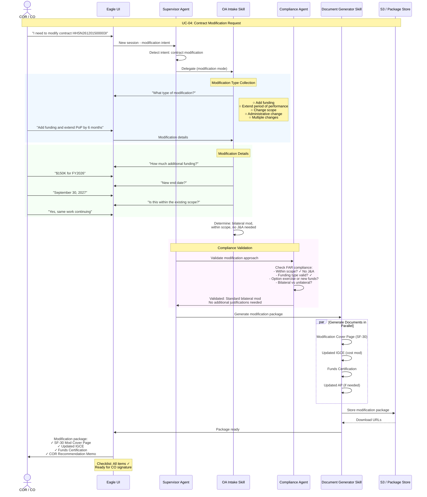

# UC-04: Contract Modification Request

**Use Case:** Add funding and extend period of performance on existing contract
**Key Pattern:** Different entry point (existing contract), Compliance validation, parallel document generation
**Actors:** COR/CO, Supervisor Agent, OA Intake Skill, Compliance Agent, Document Generator Skill

