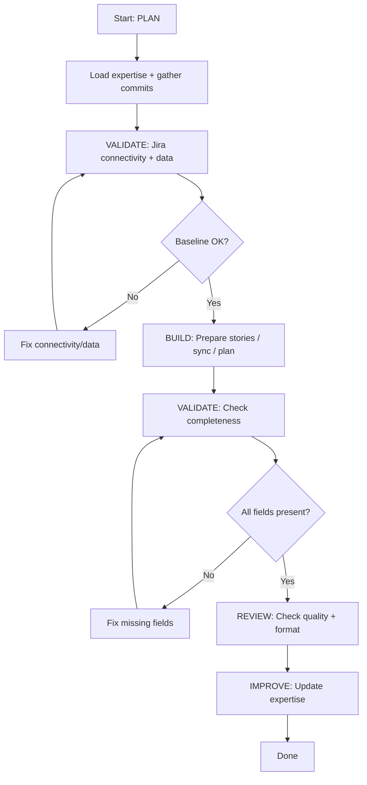

# Jira Expert - Plan Build Improve Workflow

> Full ACT-LEARN-REUSE workflow for Jira operations.

## Purpose

Execute the complete Jira workflow:
1. **PLAN** — Design the Jira operation using expertise
2. **VALIDATE (baseline)** — Verify Jira connectivity and data availability
3. **BUILD** — Execute the operation (story prep, sync, sprint plan)
4. **VALIDATE (post)** — Verify output completeness
5. **REVIEW** — Check story format and coverage
6. **IMPROVE** — Update expertise with learnings

## Usage

```
/experts:jira:plan_build_improve [operation description]
```

## Variables

- `TASK`: $ARGUMENTS

## Allowed Tools

`Read`, `Write`, `Edit`, `Bash`, `Grep`, `Glob`

---

## Workflow

### Step 1: PLAN (Context Loading)

1. Read `.claude/commands/experts/jira/expertise.md` for:
   - Story preparation pattern (Part 2)
   - Consolidation rules
   - Field requirements
   - Summary table formats
   - Learnings from past operations

2. Analyze the TASK:
   - Search for relevant commits and PRs
   - Identify spec/plan files to cite
   - Determine expert domain labels
   - Check for existing story docs

3. Create implementation plan:
   - List stories to prepare
   - Map commits to stories
   - Identify references to cite

---

### Step 2: VALIDATE (Baseline)

1. Run pre-operation checks:
   ```bash
   # Check Jira connectivity (dry-run, no API calls)
   python scripts/jira_connect.py --dry-run

   # Check git state
   git log --oneline -10
   git branch --show-current

   # Check for existing story docs
   ls -la docs/jira-new-items-*.md 2>/dev/null
   ```

2. Verify data availability:
   - Are the commits accessible?
   - Do the PRs exist?
   - Are the spec paths valid?

3. **STOP if baseline fails** — Fix connectivity or data issues first

---

### Step 3: BUILD (Execute Operation)

1. For **story preparation**:
   - Collect commits since the target date
   - Group related commits into cohesive stories
   - Generate story entries using the standard format (expertise.md Part 2)
   - Write to `docs/jira-new-items-{YYYYMMDD}.md`
   - Include summary tables

2. For **commit sync**:
   - Run Phase 1 (direct key matching)
   - Run Phase 2 (semantic matching)
   - Post comments (if live mode)

3. For **sprint planning**:
   - Fetch open issues
   - Prioritize and estimate
   - Group by epic

---

### Step 4: VALIDATE (Post-Operation)

1. Run post-operation checks:
   - All commits accounted for (grouped into stories or explicitly skipped)
   - Every story has required fields (Type, Epic, Summary, Expert Domain, AC)
   - Summary tables are complete and accurate
   - PR links are valid
   - Spec paths exist

2. Compare to baseline:
   - New story doc created?
   - All commits covered?
   - No orphaned entries?

3. If validation passes: proceed to review
4. If validation fails: fix and re-run

---

### Step 5: REVIEW

1. Review story quality:
   - Are stories cohesive (not one-per-commit)?
   - Do descriptions tell a clear narrative?
   - Are AC specific and verifiable?
   - Are expert domain labels correct?
   - Are priority/effort estimates reasonable?

2. Check format compliance:
   - YAML-style field list
   - Checked `[x]` for Done, unchecked `[ ]` for To Do
   - Short SHAs in commits
   - Proper PR link format

---

### Step 6: IMPROVE (Self-Improve)

1. Determine outcome:
   - **success**: All stories well-formed, good coverage
   - **partial**: Some stories need refinement
   - **failed**: Significant issues found

2. Update `.claude/commands/experts/jira/expertise.md`:
   - Add to `patterns_that_work`
   - Add to `patterns_to_avoid`
   - Document any `common_issues`
   - Add helpful `tips`

3. Update `last_updated` timestamp

---

## Decision Points



---

## Report Format

```markdown
## Jira Operation Complete: {TASK}

### Summary

| Phase | Status | Notes |
|-------|--------|-------|
| Plan | DONE | {story count} stories planned |
| Baseline | PASS | Jira reachable, data available |
| Build | DONE | {output file or action taken} |
| Validation | PASS | All fields present, tables complete |
| Review | PASS | Stories are cohesive and well-formed |
| Improve | DONE | Expertise updated |

### Output

- File: `docs/jira-new-items-{date}.md`
- Stories: {N} completed, {N} new
- Commits covered: {N}

### Learnings Captured

- Pattern: {what worked}
- Tip: {useful observation}
```

---

## Instructions

1. **Follow the workflow order** — Don't skip validation steps
2. **Stop on failures** — Fix before proceeding
3. **Consolidate commits** — Group related commits, don't create one story per commit
4. **Always improve** — Even failed attempts have learnings
5. **Cite references** — Every story links to PRs, specs, reports
6. **Use expert domains** — Label stories with the relevant expert areas
