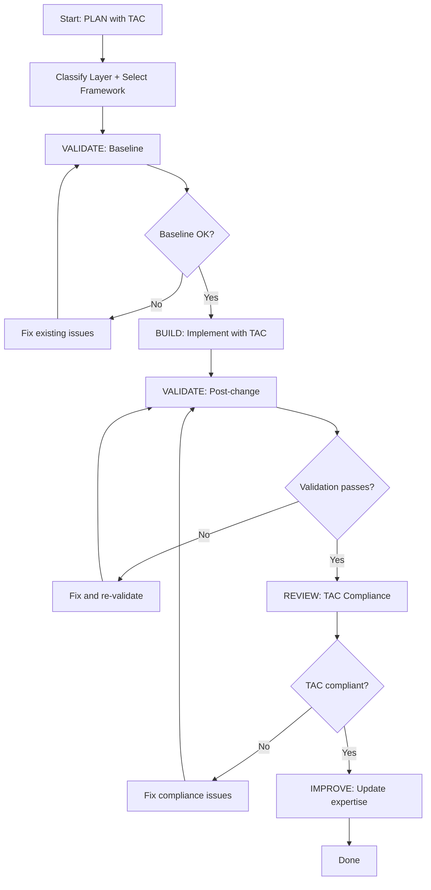

# TAC Expert - Plan Build Improve Workflow

> Full ACT-LEARN-REUSE workflow for TAC-guided development.

## Purpose

Execute the complete TAC development workflow:
1. **PLAN** - Design using TAC tactics and frameworks
2. **VALIDATE (baseline)** - Check current state
3. **BUILD** - Implement following TAC principles
4. **VALIDATE (post)** - Verify implementation
5. **REVIEW** - Check TAC compliance
6. **IMPROVE** - Update expertise with learnings

## Usage

```
/experts:tac:plan_build_improve [feature or implementation]
```

## Variables

- `TASK`: $ARGUMENTS

## Allowed Tools

`Read`, `Write`, `Edit`, `Bash`, `Grep`, `Glob`

---

## Workflow

### Step 1: PLAN (Context Loading + TAC Analysis)

1. Read `.claude/commands/experts/tac/tac-learning-expertise.md` for:
   - Applicable tactics (Part 1)
   - Framework selection (Part 4)
   - Post-14 lesson patterns (Part 3)

2. Read `.claude/commands/experts/tac/expertise.md` for:
   - Pattern references (Part 4: Ecosystem Graph)
   - Hook architecture if relevant (Part 1)
   - SSVA patterns if applicable (Part 2)
   - Agent team workflow patterns (Part 5)

2. Analyze the TASK:
   - Classify the agentic layer (Class 1, 2, or 3)
   - Select the framework (PITER, R&D, or ACT-LEARN-REUSE)
   - Identify applicable workflow pattern
   - Map TAC tactics to implementation steps

3. Scan existing project structure:
   ```
   Glob: .claude/commands/experts/*/_index.md
   Glob: .claude/commands/*.md
   Glob: .claude/hooks/*
   ```

4. Create implementation plan:
   - Write to `.claude/specs/tac-{feature}.md`
   - Include TAC compliance checklist
   - Include validation strategy

---

### Step 2: VALIDATE (Baseline)

1. Run pre-change validation:
   - Check that existing experts have valid structure:
     ```
     Glob: .claude/commands/experts/*/_index.md
     Glob: .claude/commands/experts/*/expertise.md
     ```
   - Verify hooks are syntactically valid (if modifying hooks):
     ```bash
     bash -n .claude/hooks/*.sh 2>&1
     ```
   - Verify any source files that will be modified:
     ```bash
     python -c "import py_compile; py_compile.compile('{file}', doraise=True)"
     ```

2. Note baseline state for comparison

3. **STOP if baseline is broken** - Fix existing issues first (Tactic 5: Feedback Loops)

---

### Step 3: BUILD (Implement with TAC Principles)

1. Follow the plan from Step 1
2. Apply TAC tactics during implementation:
   - **Tactic 1 (Stop Coding)**: Agent writes all code
   - **Tactic 3 (Template Engineering)**: Use existing patterns as templates
   - **Tactic 4 (Stay Out Loop)**: Complete without human interruption
   - **Tactic 5 (Feedback Loops)**: Validate after each change
   - **Tactic 6 (One Agent One Prompt)**: Keep prompts focused

3. For new experts, create all standard files:
   - `_index.md` - Expert overview
   - `expertise.md` - Domain mental model
   - `question.md` - Read-only Q&A
   - `plan.md` - Planning command
   - `self-improve.md` - Learning command
   - `plan_build_improve.md` - Full workflow
   - `maintenance.md` - Validation command

4. For new hooks:
   - Follow flat structure (Part 5)
   - Use dispatcher pattern for stop hooks
   - Make handlers idempotent

5. Keep changes atomic

---

### Step 4: VALIDATE (Post-Implementation)

1. Run post-change validation:
   - Expert structure check:
     ```
     Glob: .claude/commands/experts/{domain}/*.md
     ```
     Verify: _index.md, expertise.md, and command files exist
   - Frontmatter check:
     ```
     Grep: "^---" in new/modified files
     Grep: "allowed-tools:" in command files
     Grep: "type: expert-file" in expert files
     ```
   - Hook syntax check (if applicable):
     ```bash
     bash -n .claude/hooks/{new-hook}.sh
     ```
   - Source code syntax check (if applicable):
     ```bash
     python -c "import py_compile; py_compile.compile('{file}', doraise=True)"
     ```

2. Compare to baseline:
   - All existing files still valid?
   - New files have correct structure?
   - No broken references?

3. If validation passes: proceed to review

4. If validation fails: fix and re-validate

---

### Step 5: REVIEW (TAC Compliance Check)

1. Review against TAC principles:

   | Tactic | Check | Status |
   |--------|-------|--------|
   | 1. Stop Coding | Agent wrote all code? | |
   | 2. Adopt Perspective | Designed for agent constraints? | |
   | 3. Template Engineering | Reusable patterns used? | |
   | 4. Stay Out Loop | Completable without interruption? | |
   | 5. Feedback Loops | Validation built in? | |
   | 6. One Agent One Prompt | Focused prompts? | |
   | 7. Zero-Touch | Automated where possible? | |
   | 8. Prioritize Agentics | Most agentic option chosen? | |

2. Check for anti-patterns:
   - Kitchen-sink prompts?
   - Missing self-improve capability?
   - Manual steps required?
   - Nested hook directories?

---

### Step 6: IMPROVE (Self-Improve)

1. Determine outcome:
   - **success**: Implementation complete and validated
   - **partial**: Some elements complete
   - **failed**: Implementation blocked

2. Update `.claude/commands/experts/tac/expertise.md`:
   - Add to `patterns_that_work` (with tactic references)
   - Add to `patterns_to_avoid` (with violated tactic references)
   - Document any `common_issues`
   - Add helpful `tips`

3. Update `last_updated` timestamp

---

## Decision Points



---

## Report Format

```markdown
## TAC Development Complete: {TASK}

### Summary

| Phase | Status | Notes |
|-------|--------|-------|
| Plan | DONE | Layer: Class {N}, Framework: {name} |
| Baseline | PASS | Existing structure valid |
| Build | DONE | {files created/modified} |
| Validation | PASS | Structure and syntax verified |
| TAC Review | PASS | All 8 tactics checked |
| Improve | DONE | Expertise updated |

### TAC Analysis

| Dimension | Value |
|-----------|-------|
| Agentic Layer | Class {N}: {name} |
| Framework | {PITER / R&D / ACT-LEARN-REUSE} |
| Workflow Pattern | {pattern} |
| Tactics Applied | {list} |

### Files Created/Modified

| File | Action | Layer |
|------|--------|-------|
| {path} | Created/Modified | Class {N} |

### TAC Compliance

- [x] Tactic 1: Stop Coding
- [x] Tactic 3: Template Engineering
- [x] Tactic 4: Stay Out Loop
- [x] Tactic 5: Feedback Loops
- [x] Tactic 6: One Agent One Prompt
- [x] Tactic 8: Prioritize Agentics

### Learnings Captured

- Pattern: {what worked} (Tactic {N})
- Tip: {useful observation}
```

---

## Instructions

1. **Follow the workflow order** - Don't skip validation steps
2. **Stop on failures** - Fix before proceeding (Tactic 5)
3. **Map every step to a tactic** - TAC compliance is the goal
4. **Keep atomic** - One feature or related group per workflow
5. **Always improve** - Even failed attempts have learnings (ACT-LEARN-REUSE)
6. **Classify the layer** - Know if you're working in Class 1, 2, or 3
7. **Check anti-patterns** - Explicitly verify no TAC violations
