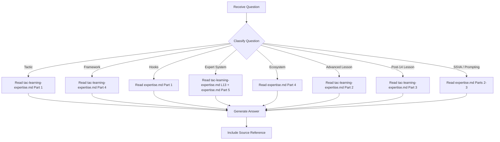

# TAC Expert - Question Mode

> Read-only command to query TAC methodology knowledge without making any changes.

## Purpose

Answer questions about Tactical Agentic Coding (TAC) -- tactics, frameworks, hook architecture, agent patterns, ecosystem structure -- **without making any code changes**.

## Usage

```
/experts:tac:question [question]
```

## Allowed Tools

`Read`, `Glob`, `Grep` (read-only only)

## Expertise Files

The TAC expert has TWO expertise files:

| File | Covers | Use For |
|------|--------|---------|
| `tac-learning-expertise.md` | Theory: 8 tactics, lessons 9-27, frameworks, maturity model | Tactic questions, lesson questions, framework questions |
| `expertise.md` | Practice: hooks, SSVA, prompting patterns, ecosystem, agent teams, learnings | Hook questions, pattern questions, ecosystem questions |

## Question Categories

### Category 1: Tactic Questions

Questions about specific TAC tactics or the 8 fundamentals.

**Examples**:
- "What is Tactic 4: Stay Out of the Loop?"
- "How do the 8 tactics relate to each other?"
- "What's the difference between Stop Coding and Stay Out Loop?"

**Resolution**:
1. Read `.claude/commands/experts/tac/tac-learning-expertise.md` -> Part 1
2. Provide formatted answer with tactic details

---

### Category 2: Framework Questions

Questions about PITER, R&D, ACT-LEARN-REUSE, or Core Four.

**Examples**:
- "How does ACT-LEARN-REUSE work?"
- "When should I use PITER vs R&D?"
- "What are the Core Four files?"

**Resolution**:
1. Read `.claude/commands/experts/tac/tac-learning-expertise.md` -> Part 4
2. Provide framework description with usage guidance

---

### Category 3: Hook Architecture Questions

Questions about TAC-compliant hook design.

**Examples**:
- "How should stop hooks be structured?"
- "What is the dispatcher pattern?"
- "How does hook chaining work?"

**Resolution**:
1. Read `.claude/commands/experts/tac/expertise.md` -> Part 1
2. Provide architecture description with code examples

---

### Category 4: Expert System Questions

Questions about the expert pattern and command structure.

**Examples**:
- "What files does an expert need?"
- "How do experts self-improve?"
- "What commands are standard for every expert?"

**Resolution**:
1. Read `.claude/commands/experts/tac/tac-learning-expertise.md` -> Lesson 13
2. Read `.claude/commands/experts/tac/expertise.md` -> Part 5 (catalogs)
3. Optionally scan `.claude/commands/experts/` for live examples

---

### Category 5: Ecosystem Questions

Questions about the Claude Code ecosystem graph and layer architecture.

**Examples**:
- "What are the three agentic layer classes?"
- "How does the context hierarchy work?"
- "What patterns exist at Class 3?"

**Resolution**:
1. Read `.claude/commands/experts/tac/expertise.md` -> Part 4
2. Provide layer and pattern descriptions

---

### Category 6: Advanced Lesson Questions

Questions about Lessons 9-14 (Context Engineering through Codebase Singularity).

**Examples**:
- "What is context engineering?"
- "How do specialized agents differ from multi-agent orchestration?"
- "What is codebase singularity?"

**Resolution**:
1. Read `.claude/commands/experts/tac/tac-learning-expertise.md` -> Part 2
2. Provide lesson explanation with practical implications

---

### Category 7: Post-14 Lesson Questions

Questions about applied project lessons (15-27).

**Examples**:
- "What is SSVA?"
- "How does multi-agent observability work?"
- "What are progressive execution modes?"

**Resolution**:
1. Read `.claude/commands/experts/tac/tac-learning-expertise.md` -> Part 3
2. Cross-reference with `.claude/commands/experts/tac/expertise.md` for practical patterns

---

### Category 8: SSVA / Agentic Prompting Questions

Questions about Specialized Self-Validating Agents and agentic prompting patterns.

**Examples**:
- "How does block/retry self-correction work?"
- "What's the difference between commands and agents?"
- "How do agent teams replace ADWs?"

**Resolution**:
1. Read `.claude/commands/experts/tac/expertise.md` -> Parts 2-3
2. Provide pattern description with examples

---

## Workflow



---

## Report Format

```markdown
## Answer

{Direct answer to the question}

## Details

{Supporting information from expertise files}

## TAC Reference

- Source: {tac-learning-expertise.md or expertise.md} -> {section/part}
- Tactic {N}: {name} (if applicable)
- Framework: {name} (if applicable)
```

---

## Instructions

1. **Read both expertise files as needed** - Theory in `tac-learning-expertise.md`, patterns in `expertise.md`
2. **Never modify files** - This is a read-only command
3. **Be specific** - Reference exact parts, tactics, and frameworks
4. **Connect to practice** - When possible, relate TAC concepts to this project's structure
5. **Suggest next steps** - If appropriate, suggest which TAC command to run next
