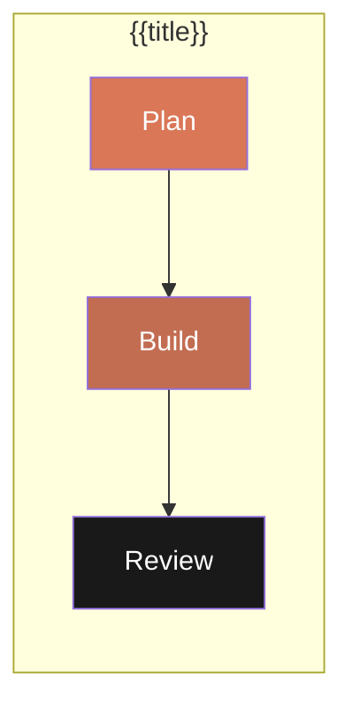

# {{title}}

## Overview
Brief description of this Agent Team Workflow.

## Pattern
> **Type**: `plan_build_review`
> **Steps**: 3 (Plan -> Build -> Review)

## Workflow Diagram


## Agents
| Agent | Role | Step | Status |
|-------|------|------|--------|
| plan-agent | Creates implementation plan | 1 | Active |
| build-agent | Implements the plan | 2 | Active |
| review-agent | Reviews code quality | 3 | Active |

## Input Schema
```json
{
  "prompt": "Feature description",
  "working_dir": "/path/to/project",
  "model": "claude-opus-4-6"
}
```

## Output Schema
```json
{
  "plan_path": "specs/feature-name.md",
  "build_status": "complete",
  "review_verdict": "PASS"
}
```

## Triggers
- Manual: `start workflow: {{title}}: <prompt>`
- Command: `/experts:{{domain}}:plan_build_improve "{{prompt}}"`

## Related
- Skills: [[skill-name]]
- Experts: [[expert-name]]
- Documentation: [[link]]

## Source Files
- Workflow: `.claude/commands/experts/{{domain}}/plan_build_improve.md`

## Changelog
- {{DATE}}: Created
